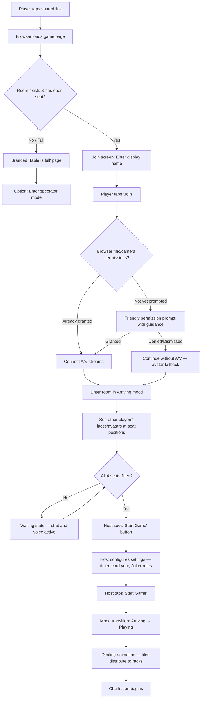
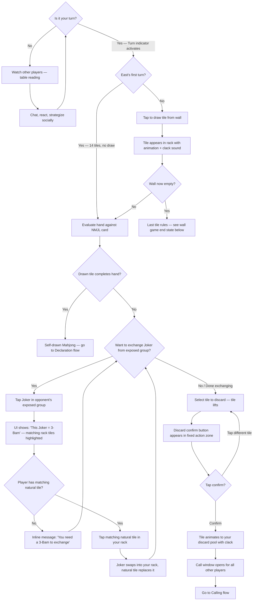
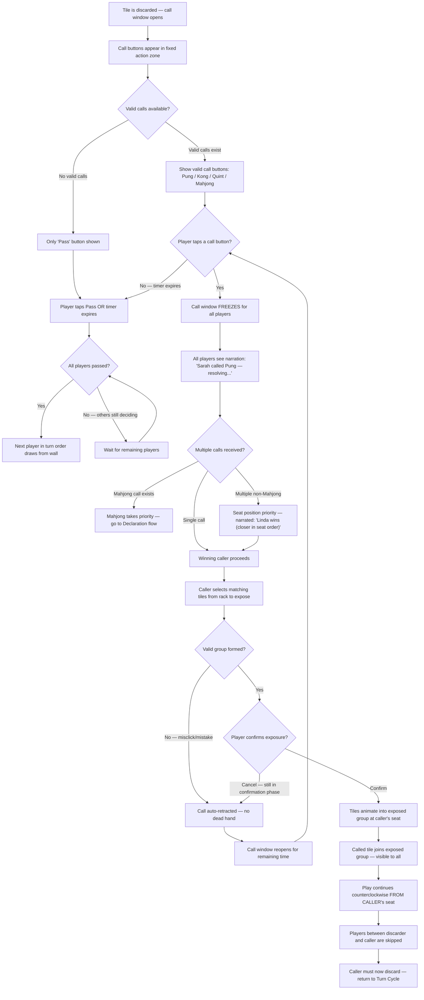
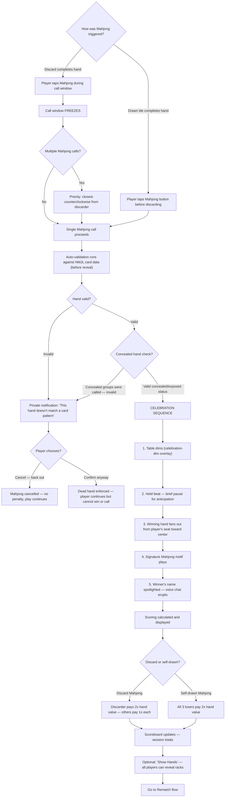
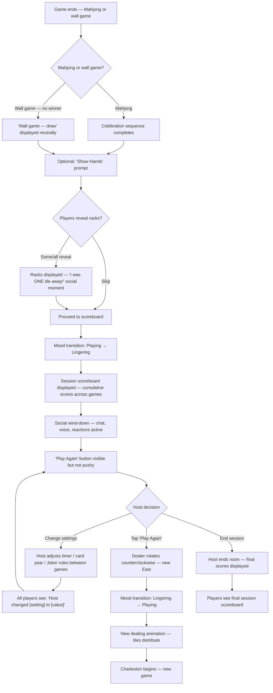

# UX Design Specification: Mahjong Night

**Author:** Rchoi
**Date:** 2026-03-26

---

<!-- UX design content will be appended sequentially through collaborative workflow steps -->

## Executive Summary

### Project Vision

Mahjong Night is a browser-based, real-time multiplayer American Mahjong game whose UX must serve a singular promise: **Nobody gets left out of game night.** The experience must feel like sitting at a beautifully set table with friends — warm, social, and effortlessly elegant. The game targets an audience (predominantly women 40-70+) who are experts at Mahjong but not at digital interfaces. Every UX decision must pass two tests: "Would my mom figure this out without help?" and "Would she show this to her friends because it's beautiful?"

The design philosophy is **"confident clarity with beautiful details"** — high contrast, generous sizing, and obvious affordances ARE the elegance. This audience reads visual confidence as quality. Subtlety is the enemy of usability for this demographic. The product competes not against other Mahjong apps, but against doing nothing — groups that skip digital play entirely because existing options are too clunky. Zero friction (no downloads, no accounts, share a link and play) is the UX foundation everything else is built on — though it is a double-edged sword: browser-based access makes the game easy to try but also easy to forget. The UX quality is bottlenecked by the least technical player in any group, not the average. If one of four players can't grant mic permissions or finds the layout confusing, the entire group's experience degrades.

### Target Players

**Primary: The Regular Player (age 40-70+, predominantly women)**
- Plays American Mahjong weekly at home or in clubs
- Knows NMJL rules deeply — will notice rule mistakes immediately
- An expert at Mahjong, not at interfaces — deeply knowledgeable about the game but unfamiliar with digital game UIs. Doesn't need rules explained; needs buttons explained. Zero tolerance for interface confusion.
- Appreciates beautiful design — owns curated tile sets, stylish accessories
- Primary motivation: social connection with friends, convenience when the group can't meet
- Session length: 60-90 minutes (matching in-person play)
- Will play on both desktop and mobile (iPad is likely a common device — possibly the primary device)
- Learns by watching others first, not by exploring the UI — every action must be visible when relevant, not discovered through menus
- Biggest UX fear is "breaking something" — the UI must prevent mistakes through clear confirmation steps rather than relying on undo, since game rules make many actions irretractable once confirmed
- May also serve as Host: creates the room, shares the link, manages settings. For MVP, the host is the most tech-comfortable person in the group. Host UX should be fast and functional — a power-user path, not a mass-market flow.

**Secondary: The Newcomer**
- Friend or family member of a regular player
- Little to no American Mahjong experience
- Will learn by playing with experienced friends over voice chat
- Needs the UI to be approachable without being patronizing
- Won't read a tutorial — must learn through contextual guidance and social coaching

### Key Design Challenges

1. **Complex game, non-gamer audience** — American Mahjong has deep mechanics (Charleston blind passing, Joker exchange, concealed/exposed hands, 50+ card patterns). The UI must surface complexity progressively without overwhelming newcomers or slowing down experienced players. One moment of confusion and this audience is gone. A turn contains multiple discrete actions (recognize it's your turn, draw, evaluate, discard) that experienced players chain automatically but newcomers process individually — each micro-moment must be self-evident in isolation.

2. **Desktop and mobile are nearly two different UX products** — Beyond responsive layout, the information architecture diverges fundamentally: always-visible NMJL card sidebar vs. toggle overlay, generous video frames vs. corner thumbnails, hover states vs. tap-only interactions. The game table must display: player rack (13-14 tiles), NMJL card (50+ hands), 4 discard pools, exposed groups, wall counter, chat, video thumbnails, and action buttons. Desktop has room for parallel information; mobile requires aggressive progressive disclosure and a distinct interaction hierarchy. iPad (likely the primary device for this audience) sits at the breakpoint boundary and may need to be treated as the primary design target.

3. **Time-pressured calls for a relaxed audience** — The 3-5 second call window is the fastest interaction in the game. For players who don't play action games, call buttons must be instantly recognizable, positioned predictably, and forgiving of mistakes (retraction, freeze-on-click).

4. **Voice/video onboarding for non-technical users** — Browser permission prompts for mic/camera are inherently confusing. A poor first experience here means players never enable social features — the product's core differentiator.

5. **Long-session reliability** — 60-90 minute sessions mean reconnection, state persistence, and A/V stability are not edge cases. Any interruption breaks the social flow that IS the product. Degraded experiences (dead hands, dropped connections, confused newcomers) determine whether the group comes back — the worst game night matters more than the best.

6. **Ritual friction vs. bad friction** — American Mahjong has deliberate, game-serving friction that players welcome as part of the ritual: the two-step discard, the Charleston passing sequence, the call confirmation. The UX must preserve and even celebrate this ritual friction while ruthlessly eliminating unnecessary friction (confusing layouts, hidden actions, ambiguous states). This distinction is a core design principle.

### Design Opportunities

1. **Three Moods as emotional architecture** — The visual shift between Arriving (warm lobby), Playing (focused table), and Lingering (relaxed scoreboard) mirrors the real-life arc of game night. No competitor does this. The Arriving mood is especially critical: a newcomer's first screen should feel like walking into a room where friends are already gathered, not like loading into a game interface. Player presence (video, names, greetings) should dominate the visual hierarchy before any game elements appear.

2. **Celebration as trust chain payoff** — The Mahjong declaration moment (dim, held beat, hand fan-out, spotlight) is powerful because it's the culmination of a trust chain: hand guidance helped the player recognize the win, the persistent Mahjong button was always in the same place, and auto-validation confirmed the win before revealing it to others. The celebration is only as strong as the weakest link in this chain.

3. **Invisible onboarding via hand guidance — with limits** — Highlighting achievable hands on the NMJL card lets newcomers learn through play alongside experienced friends — no tutorial, no interruption, no patronizing popups. However, hand guidance assumes the player can read the NMJL card at all. For a true newcomer who doesn't know what a Pung or Kong is, the card itself is incomprehensible. This gap between "no tutorial" and "hand guidance" needs a UX bridge.

4. **Audio identity** — The signature Mahjong motif and tactile tile sounds (real acrylic-on-felt) can create a sensory brand. Players should hear that motif in their head when someone texts "game night tonight?"

5. **Visibility and information design as the real UX battleground** — For this audience, "Can I understand what's happening at a glance?" matters more than visual beauty. Whose turn is it? What can I do right now? What just happened? How close am I to winning? These questions need instantly readable answers through clear typography, spatial hierarchy, and state communication. This audience trusts what they can see and distrusts hidden state — "Did it work?" should never be a question. Get the information design right and the visual elegance amplifies it. Get it wrong and no amount of felt texture or gold accents will save the experience.

## Core Player Experience

### Defining Experience

The Executive Summary establishes that social connection is the destination and game mechanics are the vehicle. The core experience is more specifically the **rhythm between game and conversation**: play your turn, chat while others play theirs, react to a big call, tease someone about a discard. This rhythm mirrors in-person play where the game provides structure and the socializing fills the spaces between turns. The UX must protect this rhythm — nothing should break the flow of simultaneous play and conversation.

### Platform Strategy

**Primary design target: iPad in landscape orientation (1024px)**

The target demographic (women 40-70+) over-indexes on iPad usage. The realistic usage pattern is iPads propped on kitchen tables and couches, with some laptop users and occasional phone players. Design decisions should optimize for iPad-landscape first, then adapt upward to desktop and downward to phone.

| Platform | Viewport | Priority | Adaptation Strategy |
|---|---|---|---|
| **iPad landscape** | ~1024px | **Primary** | The reference design — all layout decisions start here |
| **Desktop** | >1024px | Secondary | More space available — use for larger video frames and expanded NMJL card detail, but avoid sparse layouts that feel like a stretched tablet app |
| **iPad portrait** | ~768px | Secondary | Narrower: NMJL card shifts to overlay, video frames shrink |
| **Phone landscape** | ~667-926px | Tertiary | Minimal: simplified layout, essential elements only |
| **Phone portrait** | 375-430px | Tertiary | Most constrained: full progressive disclosure, card overlay, minimal video |

**Input model:**
- **iPad/phone:** Touch-first. Tap-to-select, tap-to-confirm. Drag-and-drop for rack arrangement only (not required for core gameplay). All tap targets minimum 44px.
- **Desktop:** Mouse + keyboard. Click interactions mirror tap. Keyboard navigation (Tab/Arrow/Enter/Escape) as first-class input. Hover states for additional context.
- **Cross-platform constant:** The two-step discard (select tile, confirm in action zone) works identically across all platforms — same interaction model, same visual feedback, adapted sizing.

**Voice/video as default layout assumption:**
Video frames at each player's seat position are first-class layout elements, not optional add-ons. The table layout is designed with video present. When A/V is off or unavailable, the space adapts gracefully (avatar circles with name labels and speaking indicators occupy the same space) but the layout doesn't fundamentally restructure — this prevents jarring layout shifts when someone toggles their camera. If voice/video is deferred (Epic 6B is the explicit cut line), the seat-position layout still works: avatar circles maintain the "people at a table" metaphor. The layout doesn't depend on video being present — it depends on player presence being visible.

### Effortless Interactions

**Flows that must feel effortless:**

1. **Joining a game** — Tap a link, type your name, see your friends. This is the zero-friction promise and the make-or-break first impression. Under 10 seconds from link tap to seeing the table. No account creation, no settings, no tutorial gates.

2. **Discarding a tile** — The most frequent action in the game. Tap a tile (it lifts), tap the "Discard" confirm button in the fixed action zone (it slides to the discard pool with a satisfying clack). Two steps, always the same, always in the same place. The confirm button appears instantly in the action zone — the same fixed region where call buttons appear — and is large enough to tap without hesitation. This interaction happens 30+ times per game — if it feels even slightly clunky, the friction compounds into frustration.

3. **Ending and restarting** — After Mahjong or a wall game, the celebration/scoreboard flows naturally into a "play again?" moment. One tap to rematch. No room recreation, no re-sharing links, no settings reconfiguration.

**Moments that must feel effortless:**

4. **Knowing whose turn it is** — Turn state must be ambient and unmissable. The current player's seat area should be visually distinct at all times. No one should ever need to ask "is it my turn?" — the answer should be obvious from across the room on a propped-up iPad.

5. **Drawing a tile** — One tap. The tile appears in your rack. A subtle animation and sound confirm it happened. No drag, no placement decision — just tap and it's yours.

6. **Reading the table** — Glancing at the screen should answer: whose turn, how many tiles left in the wall, what's been discarded, who has exposed groups. This information is always visible, never hidden behind tabs or toggles on the primary (iPad) layout.

7. **Chatting while playing** — Voice chat just works. Text chat is always accessible without leaving the game view. The social layer never competes with the game layer for attention or screen space.

8. **Reacting and expressing** — One-tap reactions (thumbs up, laughing, groaning) let players express without interrupting voice chat or typing. Reaction sounds are brief and expressive. Sending a reaction should be as easy as tapping an emoji — no menu navigation, no panel opening, just a persistent row of 4-6 reactions always visible near the chat area.

### Critical Success Moments

These are the moments that determine whether the group comes back next week:

1. **"I can see everyone!" (First 30 seconds)** — The newcomer taps the link, types their name, and sees their friends' faces on screen. Voice chat connects. Someone says "Hey! You made it!" This is the moment the product delivers on its promise. If this moment fails — slow loading, permission confusion, no video — the social energy never starts.

2. **"Oh, THAT's how this works" (First turn)** — The newcomer's first turn. The turn indicator is obvious. They tap to draw. They see their tiles. They tap a tile to discard, see the confirm button, tap it. The tile slides away with a satisfying clack. They just played their first turn of Mahjong. It took 5 seconds and zero explanation.

3. **"Wait, I can take that?" (First call)** — A tile is discarded and the call button appears. The newcomer has been watching others do this for a few rounds. She taps "Pung," selects the matching tiles from her rack, and confirms. The called tile and her tiles animate into an exposed group in front of her. She just did something she's seen experienced players do. The interaction was clear enough to attempt and forgiving enough to survive a mistake (retraction during confirmation). This moment converts a spectator into a participant.

4. **"I can't BELIEVE you passed me that" (Charleston)** — The Charleston is the peak social moment. All four players are active simultaneously, groaning and laughing about what they're passing and receiving. If this interaction feels alive and social — with clear direction indicators, easy tile selection, and voice chat buzzing — the product has recreated game night. If it feels like filling out a form, it hasn't.

5. **"MAHJONG!" (Declaration)** — A player wins. The table dims, the hand fans out, the motif plays, and the voice chat erupts. This is the emotional climax that players will remember and talk about between sessions. The celebration must feel earned and shareable — the kind of moment that makes someone text a screenshot to a friend who wasn't playing.

6. **"One more game" (Rematch)** — The scoreboard shows, hands are optionally revealed, the group rehashes the game. Someone taps "play again." Seats rotate, tiles deal, and they're back at it. The transition from one game to the next should feel as natural as reshuffling physical tiles — no friction, no waiting, just the rhythm of game night continuing.

### Experience Principles

These principles guide all UX decisions for Mahjong Night:

1. **Show, don't hide** — If a player needs to know it, show it. If a player can act on it, show the button. Progressive disclosure happens through game state (call buttons appear when a call is possible), never through navigation (features behind menus or toggles). On the primary iPad layout, the only hidden element is the chat history (accessible via a persistent panel edge).

2. **Protect the rhythm** — The game has a natural rhythm: play, chat, react, play. Every UX decision must protect this rhythm. Modals interrupt rhythm (use inline confirmations). Loading screens interrupt rhythm (preload aggressively). Layout shifts interrupt rhythm (video frames don't resize when cameras toggle). Animation delays interrupt rhythm (time-sensitive actions like call buttons appear instantly).

3. **Confirm before consequence** — Any action with game consequences gets a confirmation step. Discard: select then confirm. Call: click then expose tiles. Mahjong: click then auto-validate. The confirmation is the safety net for an audience whose biggest fear is "breaking something." But confirmation must be fast (one tap, not a modal dialog) and positioned near the action (not a distant "Are you sure?" popup).

4. **Same place, every time** — Interactive elements live in fixed positions. The Mahjong button is always in the same spot. The discard confirm always appears in the fixed action zone — the same region as call buttons. Call buttons always appear in the same zone. This audience builds muscle memory through repetition and loses trust when things move.

5. **Social first, game second** — When layout real estate is contested, social elements (video frames, chat, reactions) take priority over information elements (detailed scoring, hand guidance, settings). Players can win Mahjong without hand guidance; they can't recreate game night without seeing their friends.

6. **Forgive when the rules allow it** — When the game rules permit recovery (call retraction during confirmation, social override for accidental discards, Mahjong cancel before confirmation), the UI must make the recovery path as obvious as the action path. A "Cancel" or "Undo" option should be visually prominent during the recovery window, not hidden or subtle. When the rules DON'T permit recovery (exposed groups are permanent, confirmed Mahjong is final), the confirmation step from P3 carries the full weight — the player must know this is the point of no return.

**Priority justification:** P1-P4 are ordered by foundational importance for this specific audience: showing everything (P1) enables rhythm (P2), confirmation (P3) enables trust, and consistency (P4) enables learning. P5 (Social first) is not ranked lower because social matters less — it's the product's reason to exist — but because it's a layout tiebreaker that only activates when P1-P4 create a space conflict. P6 (Forgive) is a recovery safety net that operates within the constraints set by P1-P5.

## Desired Emotional Response

### Primary Emotional Goals

**Belonging** — "I'm at the table with my friends." Not just connected — *belonging*. "Connected" is a technology promise (video works, chat works); "belonging" is a social promise (I'm part of this group, I'm included, I matter here). The entire product thesis — "Nobody gets left out of game night" — is a belonging statement.

**Supporting Emotions:**

1. **Confidence** — "I know exactly what to do." For an audience whose biggest fear is "breaking something," the interface must radiate certainty. Every action is obvious, every consequence is previewed, every mistake is recoverable (when rules allow). Confidence isn't excitement — it's the quiet absence of doubt.

2. **Delight in craft** — "Oh, this is *nice*." The felt texture, the tile clack, the celebration fan-out — these aren't features, they're emotional signals that say "someone cared about this." This audience owns curated tile sets and stylish accessories. They recognize quality. The delight isn't surprise — it's recognition of taste.

3. **Comfortable tension** — "Ooh, should I discard that?" The game provides natural tension: the wall shrinking, defensive discarding, call windows. But this tension has a deeper layer — *social deduction*. "I KNOW Linda needs 8-Dots because she just called a Kong of 7-Dots and there's a hand on the card that uses both." This social deduction tension only exists when the table is readable. Discard pools and exposed groups aren't just information displays — they're **tension generators**. If players can't read the table easily, this entire emotional layer vanishes. The UX should let tension breathe without amplifying it into anxiety.

4. **Ritual satisfaction** — "This is how the game goes." The Charleston, the two-step discard, the turn rhythm — these aren't friction, they're the game's heartbeat. The emotional payoff of ritual is that each step feels *right* and *familiar*, like shuffling physical tiles.

5. **Shared spectacle** — "Did you SEE that?!" Half the emotional energy of game night comes from *witnessing* other players' moments: the groan when someone gets passed three Jokers, the gasp when a bold call lands, the eruption when Mahjong is declared. The audience reaction IS the content. The UX must actively *stage* key moments for the audience (all four players), not just for the actor (the player taking the action). Voice chat erupting during a Mahjong declaration isn't a side effect — it's the emotional peak.

### Emotional Journey Mapping

| Phase | Feeling | UX Driver |
|---|---|---|
| **Opening the link** | Anticipation + ease | Instant load, no barriers, warm visual entrance |
| **Seeing friends** | Belonging + warmth | Player presence front and center, voice connecting, "Arriving" mood |
| **Charleston** | Social buzz + playful strategy | Everyone active simultaneously, groaning and laughing |
| **Mid-game turns** | Comfortable focus + quiet confidence | Clear turn state, obvious actions, rhythm of play-chat-play |
| **Call moments** | Brief excitement + decisiveness | Instant buttons, confident snap sound, bold exposure |
| **Approaching wall end** | Rising tension + awareness | Wall counter shrinking, strategic weight increasing |
| **Mahjong declaration** | Triumph + shared spectacle | Dim, held beat, fan-out, voice chat eruption — staged for all four players |
| **Post-game** | Warm satisfaction + social lingering | Scoreboard breathing room, "show hands," unhurried rematch |
| **Returning next week** | Eager familiarity | Same link, same friends, same beautiful table |

### Micro-Emotions

**Critical micro-emotion priorities (ordered):**

- **Confidence over confusion** — The #1 priority. Every pixel serves clarity.
- **Trust over skepticism** — "The game knows the rules" (auto-validation builds this). "My tiles are safe" (server authority, no glitches). Trust in the system is the foundation upon which all other emotions are built — one incorrect rule enforcement or unexplained state change collapses the entire emotional structure, not just for that player but for the whole group.
- **Belonging over isolation** — Social presence is always visible. Voice chat is default-on. Reactions let quiet players participate.
- **Accomplishment over frustration** — Even losing feels okay because the social experience was good. The celebration honors the winner without shaming the losers.
- **Delight over mere satisfaction** — The tile sounds, the felt texture, the gold accents — these elevate "it works" to "it's beautiful."
- **Shared thrill over passive observation** — Key moments (calls, Mahjong, Charleston reveals) are staged for the whole table's emotional participation, not just the acting player.

**Emotions to avoid:**

- **Confusion** — The single most destructive emotion. One moment of "what just happened?" and this audience checks out.
- **Loneliness** — If the social layer fails (video doesn't connect, no one's talking, the UI feels cold), the product fails. A beautiful game played in silence is worse than Zoom + physical tiles.
- **Patronization** — These are experts at Mahjong. Hand guidance that feels like training wheels, or UI that feels "dumbed down," will alienate them.
- **Anxiety** — The call window timer and turn pressure must feel urgent but never stressful. This is game night, not a speed test.
- **Embarrassment** — Making a mistake (wrong discard, missed call) should feel recoverable and private, never spotlighted. Dead hand notifications must be delivered **privately and gently** — a subtle indicator on the affected player's own view, not a broadcast announcement. The other players will observe the behavioral change (no more calling), but the system should never publicly shame someone.
- **Guilt** — When a player discards the tile that gives someone Mahjong (and pays double per the rules), the scoring consequence is already built into the game. The UX must never *amplify* that guilt — no spotlight on the discarder, no "you fed the win" visual treatment. The celebration is about the winner, period.

### Design Implications

| Desired Emotion | UX Design Approach |
|---|---|
| **Belonging** | Player presence at seat positions, "Arriving" mood warmth, voice-first social layer, reactions for easy expression |
| **Confidence** | Show don't hide (P1), fixed element positions (P4), two-step confirmations (P3), large readable text, obvious turn indicators |
| **Delight in craft** | Felt texture, acrylic tile sounds, brushed gold accents, celebration cinematics, Three Moods transitions |
| **Comfortable tension** | Wall counter as organic pressure (not a timer), call window as brief urgency (not panic), **readable discard pools and exposed groups as tension generators** — table readability IS the engine for social deduction |
| **Ritual satisfaction** | Charleston's deliberate pacing, two-step discard rhythm, dealing cascade, consistent interaction patterns |
| **System trust** | Auto-validation before reveal, server authority (no glitches), social override for mistakes, challenge button for disputes, **visually narrated state transitions** — the system always shows its work |
| **Shared spectacle** | Celebration sequence staged for all four players, call animations visible to everyone, Charleston groans and reactions amplified through social layer |
| **Immediate acknowledgment** | Every tap/click gets instant visual feedback (tile lifts, button depresses, subtle pulse) even before the server responds — this is NOT optimistic updates (the tile doesn't move to the discard pool), but the player knows their input was received |

### Emotional Design Principles

1. **Belonging is the baseline, not a feature** — If a player feels alone, nothing else matters. Social presence is never optional in the layout.

2. **Confidence compounds, confusion compounds** — Each clear interaction builds trust for the next. Each confusing moment makes the next interaction feel risky. Front-load clarity aggressively.

3. **The system always shows its work** — Every state transition must be visually narrated. When a call resolves, the player sees *why* Player B got the tile instead of Player C. When a Joker exchange happens, they see the tile swap, not just the result. For an audience of rule experts, unexplained outcomes destroy trust instantly.

4. **Celebrate the game, not the interface** — The UX should be invisible during the moments that matter. The celebration is about the winning hand, not about the animation. The Charleston is about the social energy, not about the UI.

5. **Stage moments for the audience, not just the actor** — Key game moments (Mahjong declaration, bold calls, Charleston reveals) should be presented so all four players experience the emotional peak together. The winner gets their spotlight, but the other three players' reactions are equally part of the moment.

6. **Acknowledge immediately, resolve eventually** — Every player input gets instant visual feedback (lift, highlight, pulse) even before the server confirms the action. The action result waits for authority; the acknowledgment is instant. This bridges the gap between "did it work?" and server response, protecting confidence.

7. **Tension is a feature when the context is safe** — The game's natural tension (call windows, wall shrinking, defensive play) is what makes it exciting. The UX's job is to make the *context* safe (clear actions, recoverable mistakes, trusted rules) so the *game* tension can be enjoyed.

8. **Never amplify negative consequences** — The game's rules already create consequences (discarder pays double, dead hands). The UX should report these neutrally and privately where possible, never spotlight or shame. Celebrations focus on the winner; consequences are communicated without editorial.

9. **Beauty earns trust with this audience** — For the primary demographic, visual quality signals competence. A polished interface says "these people know what they're doing." A rough interface makes them question whether the rules are implemented correctly. The foundation and the finish are the same wall.

## UX Pattern Analysis & Inspiration

### Inspiring Products Analysis

**1. That's Mahj (thatsmahj.com) — Lifestyle Brand as Aesthetic North Star**

That's Mahj is a luxury Mahjong retailer with a sophisticated coastal aesthetic: dusty blue-gray accents, warm taupes, crisp whites, and editorial serif typography (Newsreader). The brand treats Mahjong as a *lifestyle* — curated table settings, lifestyle photography, Instagram-forward social proof.

**What they nail:**
- **Aesthetic confidence** — The muted, sophisticated palette says "this is for women with taste," not "this is a game." The serif typography and editorial layout feel more like a home magazine than a game store.
- **Social proof as identity signal** — Instagram integration and lifestyle photography let customers see themselves in the brand. "This is who plays Mahjong" — stylish, social, intentional.
- **Warmth without kitsch** — The coastal palette avoids both the casino aesthetic (garish reds and golds) and the sterile minimalist trap. It feels *warm* and *curated*.

**UX lesson for Mahjong Night:** The color palette and brand voice of That's Mahj is closer to what our audience expects from a "quality" Mahjong product than any existing Mahjong *game* app. Our UI chrome (cream, warm neutrals, brushed gold) should feel like it belongs in this world — as if That's Mahj designed a digital experience. The deep teal felt table is our version of their coastal sophistication.

**2. Oh My Mahjong (via Anthropologie) — Premium Positioning as Trust Signal**

Oh My Mahjong sells tile sets at $325-$450 through Anthropologie, Neiman Marcus, and their own DTC site. Soft pastels (blush pink, light blue), modern typography, and lifestyle photography that shows Mahjong as aspirational entertaining — tablescapes, cocktails, curated accessories. They frame Mahjong as a "modern American ritual."

**What they nail:**
- **"Modern American ritual" framing** — They've rebranded Mahjong from "grandmother's game" to "stylish social ritual." This is exactly the emotional positioning Mahjong Night needs.
- **Photography as product design** — Every product shot is styled like a gathering. You're not buying tiles; you're buying the *evening*. This maps directly to our "Arriving" mood — the lobby should feel like walking into a styled gathering, not a game loading screen.
- **Price signals quality expectations** — At $325-$450, these customers have *high aesthetic standards*. If they're our target audience (and they are), our digital experience must meet the visual bar set by their physical tile set. A cheap-looking UI would feel incongruent with their $400 tile set sitting next to their iPad.

**UX lesson for Mahjong Night:** Our audience invests serious money in physical Mahjong aesthetics. The digital experience must feel like a worthy companion to a premium tile set, not a downgrade. This validates the GDD's emphasis on "Gorgeous, Elevated Design" — it's not aspirational, it's *table stakes* for this audience.

**3. Jackbox Games — Social-First, Non-Gamer-First UX**

Jackbox pioneered the "share a code, join from any device, play together" model that Mahjong Night's room-joining flow mirrors. Dark modern interface with high-contrast accents, and interaction patterns designed for people who've never touched a game controller.

**What they nail:**
- **Zero-friction join flow** — Enter a code on your phone, you're in. No downloads, no accounts, no tutorials. This is the exact model Mahjong Night uses (share a link, type your name, play).
- **Non-gamers as primary users** — Large touch targets, clear button hierarchy, simplified inputs, color-coded actions. They assume their player has never played a video game — same assumption we must make.
- **Social energy as the product** — Jackbox games are vehicles for social interaction. The games are simple; the laughter is the content. Our parallel: the Mahjong mechanics are the vehicle; the social connection is the product.
- **Visual feedback everywhere** — Consistent hover states, toast notifications, animated transitions. Every action produces visible confirmation.

**UX lesson for Mahjong Night:** Jackbox proves that non-gamers will enthusiastically use digital games if the friction is zero and the social payoff is immediate. Their join flow is our join flow. Their "non-gamer first" interaction design is our interaction design. But — Jackbox's aesthetic (dark, neon, young-skewing) is wrong for our audience. We take their *patterns* and dress them in That's Mahj / Oh My Mahjong *aesthetics*.

**4. Apple's Built-in Games (Chess, Cards) — Material Quality as Trust**

Apple's built-in game apps use skeuomorphic materials (wood grain, felt, leather) rendered with enough fidelity to feel *real* without looking dated.

**What they nail:**
- **Things feel like they have weight** — Pieces settle, cards slide, surfaces have texture. This "material honesty" makes digital interactions feel tactile and trustworthy.
- **No learning curve** — If you know how to play chess, you know how to use Apple Chess. The interface gets out of the way.
- **Timelessness** — These apps have barely changed visually in a decade because the material metaphor doesn't age. Our felt table + acrylic tiles should aim for the same timelessness.

**UX lesson for Mahjong Night:** The felt texture, tile weight/settle animations, and acrylic-on-felt sound design aren't decorative — they're trust signals. When things feel physical, the audience trusts them more. Apple proves that skeuomorphic material design can coexist with modern interaction patterns.

**5. iOS Solitaire — The Interaction Vocabulary Our Audience Already Knows**

iOS Solitaire (and similar card games) is likely the only digital game interface our primary audience has genuine muscle memory for. Millions of women in this demographic play it daily on their iPads.

**What they nail:**
- **Silent interaction contracts** — Tap a card, it moves. Drag to arrange. Double-tap to auto-complete. No one taught these interactions; they just work. Our tile interactions must inherit this vocabulary: tap to select (tile lifts), tap confirm to act (tile moves), drag to rearrange rack.
- **Drag/tap dead zone** — iOS Solitaire handles the boundary between "I meant to tap" and "I started a drag" gracefully with a movement threshold (~10px). Below the threshold, it's a tap. Above, it's a drag. This prevents accidental rack rearrangement from imprecise taps — critical for an audience whose biggest fear is "breaking something."
- **Immediate, unambiguous feedback** — Every touch produces instant visual response. No loading states, no spinners, no delay between input and acknowledgment.

**UX lesson for Mahjong Night:** Our players already know how to interact with digital cards/tiles from iOS Solitaire. This is a design constraint, not a coincidence — we must not violate those learned patterns. Tap-to-select, drag-to-arrange, instant visual feedback. The drag/tap dead zone threshold (10px minimum) is a mandatory implementation detail to prevent the "I accidentally moved a tile" panic.

**6. Television Sports Broadcasts — Information Density for Non-Technical Audiences**

Our game table must display an extraordinary amount of information simultaneously: 13-14 tiles, 4 discard pools, exposed groups, wall counter, NMJL card, video thumbnails, call buttons, chat, turn indicator. The question isn't "what should it look like?" — it's "how do we make this much information readable at a glance?"

Sports broadcasts solve this exact problem for casual viewers: score, time, down, yards, pitch count, batter stats — all visible simultaneously without overwhelm.

**What they nail:**
- **Spatial consistency** — Score is always top-left. Clock is always visible. Viewers build spatial memory for where to look. Our game elements must live in fixed positions (Experience Principle P4).
- **Visual hierarchy through scale** — Big numbers for the score (most important), small text for stats (secondary). Our equivalent: large tiles and action buttons (primary), smaller wall counter and discard pools (secondary), card detail and chat (tertiary/on-demand).
- **Progressive reveal** — Replays and detailed stats appear on demand, not always. Our equivalent: NMJL card detail on tap (mobile), chat history on panel open, settings behind a gear icon.
- **Mode switching for key moments** — When a touchdown scores, the broadcast switches from "game view" to "replay/celebration view." Our equivalent: when Mahjong is declared, the table switches from "playing" to "celebration" — dim, spotlight, fan-out. The broadcast metaphor supports the "Shared spectacle" emotional goal directly.

**UX lesson for Mahjong Night:** Design the game table like a broadcast overlay. Primary information (your rack, turn state, action buttons) is largest. Secondary information (discard pools, wall counter, exposed groups) is always visible at lower visual weight. Tertiary information (NMJL card detail, chat history) is one tap away. This hierarchy makes the complex game table readable at a glance for an audience that doesn't explore interfaces.

### Transferable UX Patterns

**Navigation & Information Patterns:**

| Pattern | Source | Application in Mahjong Night |
|---|---|---|
| **Always-visible reference panel** | Desktop productivity apps, Apple's game sidebars | NMJL card sidebar on desktop — always accessible, never hidden |
| **Quick-toggle overlay** | Mobile-first apps, iOS Control Center | NMJL card overlay on mobile — one tap open/close, no navigation |
| **Persistent action zone** | Jackbox (answer buttons always in same spot) | Call buttons, Mahjong button, discard confirm — fixed positions, always predictable |
| **Ambient status indicators** | Slack (presence dots), FaceTime (speaking indicators) | Turn state glow, wall counter, player presence — information without interaction |
| **Broadcast-style visual hierarchy** | Sports TV overlays | Primary (rack, actions) large; secondary (discards, wall) visible but smaller; tertiary (card detail, chat) on demand |

**Interaction Patterns:**

| Pattern | Source | Application in Mahjong Night |
|---|---|---|
| **Two-step confirm** | iOS destructive actions (slide + tap), ATM withdrawals | Tile discard (select + confirm), call confirmation (click + expose) |
| **Zero-friction join** | Jackbox (code entry), Google Meet (link join) | Share link, type name, play. Under 10 seconds. |
| **Instant touch acknowledgment** | Google Material Design ripple, iOS Solitaire | Every tap gets instant visual feedback (tile lift from touch point, button depress) before server confirms. The lift IS the acknowledgment; the move IS the resolution. |
| **Drag-to-arrange, tap-to-act** | iOS Solitaire (rearrange vs. play) | Rack arrangement is drag; gameplay actions are tap. Two modes, never confused. |
| **Drag/tap dead zone** | iOS Solitaire, iOS home screen | 10px movement threshold — below is tap, above is drag. Prevents accidental rack rearrangement from imprecise taps. |

**Visual & Emotional Patterns:**

| Pattern | Source | Application in Mahjong Night |
|---|---|---|
| **Lifestyle-grade aesthetics** | That's Mahj, Oh My Mahjong, Anthropologie | UI chrome that feels like it belongs in a home magazine, not a game app |
| **Material honesty** | Apple's built-in games | Felt texture, tile weight, acrylic sounds — digital objects that feel physical |
| **Mood-based visual phases** | Ambient music apps, smart home lighting | Three Moods (Arriving/Playing/Lingering) — same palette, different emphasis |
| **Celebration as broadcast moment** | Sports TV (replay, slow-mo, spotlight) | Mahjong declaration — mode switch from "game view" to "celebration view," staged for all players |

### Anti-Patterns to Avoid

| Anti-Pattern | Why It Fails for This Audience | What to Do Instead |
|---|---|---|
| **Casino/gambling aesthetic** | Red-and-gold, flashing, neon. Signals "cheap game," alienates a taste-driven audience | Warm modern elegance — teal, cream, brushed gold. Quality over flash. |
| **Hidden features behind menus** | This audience doesn't explore UIs. If they can't see it, it doesn't exist. | Show, don't hide (P1). Progressive disclosure via game state, not navigation. |
| **Tiny tap targets** | Players 40-70+ with varying motor precision on glass screens. 32px buttons fail silently — players think they missed, not that the target was too small. | 44px minimum (WCAG). Generous sizing IS elegance for this audience. |
| **"Gamer" visual language** | Health bars, XP indicators, achievement popups, leaderboard pressure. Wrong mental model entirely. | Board game language. Table, tiles, seats, wall, card. No gamification. |
| **Tutorial gates** | "Complete the tutorial before playing." This audience will close the app. | Learn through play + social coaching. Hand guidance as gentle background hints. |
| **Optimistic UI updates** | Tile moves before server confirms. Creates "did it work?" doubt and potential rule trust violations. | Server-authoritative with immediate acknowledgment (lift, pulse) but no state change until confirmed. |
| **Loading spinners on gameplay actions** | This audience reads a spinner as "something went wrong." A spinner on a discard action destroys the "it just works" feel instantly. | Instant visual acknowledgment (tile lift, button depress) replaces spinners entirely. The feedback is the interaction animation itself, not a loading indicator. |
| **Sound as entertainment** | Background music competing with voice chat. Players will mute everything. | Sound as tactile feedback. Tile clack, call snap, turn ping. Coexists with conversation. |
| **Dark-mode-only gaming aesthetic** | Jackbox's dark neon palette works for 20-somethings, not for 60-year-olds reading tile faces | Light mode default with warm tones. Dark mode as system-preference option, never the only option. |

### Design Inspiration Strategy

**Adopt directly:**
- Jackbox's zero-friction join flow (link, name, play)
- iOS Solitaire's tap/drag interaction vocabulary (the only digital game UX this audience has muscle memory for)
- Apple's material honesty (felt, weight, settle, tactile audio)
- Two-step confirm pattern for consequential actions
- Fixed-position action zones (call buttons, Mahjong button always in same spot)
- Instant visual acknowledgment for every input (Material ripple philosophy — acknowledge from touch point, resolve on server confirm)
- Drag/tap dead zone threshold (10px minimum) to prevent accidental rack rearrangement
- Sports broadcast visual hierarchy for information-dense game table

**Adapt for our audience:**
- That's Mahj / Oh My Mahjong aesthetics — translate from product photography to UI chrome (warm neutrals, editorial typography, curated sophistication)
- Jackbox's social energy — same philosophy, but dressed in warm elegance instead of neon party energy
- Jackbox's dark modern palette — invert to warm light mode as default; our audience associates dark interfaces with "technical" products
- Sports broadcast celebration staging — translate to the Mahjong declaration sequence (dim, beat, reveal), but understated — elegance, not spectacle
- Sports broadcast information hierarchy — apply spatial consistency and scale-based hierarchy to manage 10+ simultaneous information elements on the game table

**Avoid entirely:**
- Casino/gambling aesthetic (red-and-gold, flash, noise)
- Gamer visual language (XP, achievements, leaderboards, health bars)
- Tutorial gates or onboarding flows that delay play
- Tiny interaction targets or hover-dependent interactions
- Loading spinners on any gameplay action
- Sound design that competes with voice chat
- Any aesthetic that would feel incongruent next to a $400 Oh My Mahjong tile set on the same table

## Design System Foundation

### Design System Choice

**Custom Design System built on UnoCSS (presetWind4)**

Mahjong Night uses a fully custom design system — no third-party component library (Material, Chakra, Ant). Every component is purpose-built for this game's specific interaction patterns and aesthetic requirements. UnoCSS with presetWind4 provides the utility-first CSS foundation, with design tokens defined as UnoCSS theme values that auto-generate CSS custom properties.

### Rationale for Selection

1. **No existing component library fits this product** — Mahjong Night's UI components (tile rack, discard pool, call buttons, NMJL card sidebar, Charleston passing zone) have no equivalent in any design system. Generic button/card/modal components would need so much customization that starting custom is faster.

2. **Aesthetic requirements exceed generic systems** — The "warm modern elegance" aesthetic (felt texture, brushed gold accents, Three Moods phase transitions, celebration cinematics) requires pixel-level visual control that themed component libraries constrain.

3. **Solo developer, no design handoff** — There's no designer handing off Figma files that map to a component library. The developer IS the designer. A custom system built incrementally as components are needed is more efficient than configuring and overriding a large library.

4. **UnoCSS is already chosen** — The architecture commits to UnoCSS with presetWind4, CSS custom properties, and theme-driven color tokens. This IS the design system foundation — adding a component library on top would create two competing style systems.

5. **Performance** — No unused component library CSS. Every style is purpose-built. The bundle stays lean (under 5MB total target).

### Implementation Approach

**All design tokens defined in UnoCSS theme config (`uno.config.ts`), which auto-generates CSS custom properties (e.g., `--colors-felt-teal`). Components reference tokens via utility classes (`bg-felt-teal`) — never hardcoded values.**

#### Color Tokens

**Surface & Chrome (reference values — tune during implementation):**
- `felt-teal` — Deep teal game table surface (~#2A6B6B range, with CSS grain/noise overlay for material texture)
- `chrome-surface` — Warm cream/off-white for UI panels (~#F5F0E8 range, light mode)
- `chrome-surface-dark` — Dark warm gray/charcoal (~#2C2A28 range, dark mode)
- `chrome-border` — Soft warm gray for panel borders and dividers (~#D4CFC5 range)
- `chrome-elevated` — Slightly lighter surface for raised panels and cards
- `gold-accent` — Brushed matte gold for interactive highlights (~#C4A35A range — warm gold, not yellow-gold, not rose-gold)
- `gold-accent-hover` — Slightly brighter gold for hover/active states

**Text:**
- `text-primary` — High-contrast warm dark (~#2C2420 range, meets WCAG AA on chrome surfaces)
- `text-secondary` — Medium-contrast for labels and secondary information
- `text-on-felt` — Light text optimized for readability against teal felt
- `text-on-dark` — Light text for dark mode chrome surfaces

**Tile Suits (primary vibrancy source):**
- `suit-bam` — Green for Bamboo tiles
- `suit-crak` — Red for Crack tiles
- `suit-dot` — Blue for Dot tiles
- Each suit also has a shape/pattern distinguisher for color-blind accessibility

**Game State:**
- `state-turn-active` — Warm glow for the active player's seat area
- `state-call-window` — Alert tone for call window urgency
- `state-success` — Gentle green for valid actions and confirmations
- `state-error` — Mode-adaptive coral for invalid actions: #B8553A (light mode, 4.21:1 on chrome), #E8896E (dark mode, 5.61:1 on dark chrome). Error inline messages use a subtle coral background tint with `text-primary` text. Never harsh red.
- `state-warning` — Warm amber for timeout nudges and warnings

**Wall Counter States:**
- `wall-normal` — Neutral presentation (default counter appearance)
- `wall-warning` — Amber tone (suggested threshold: ≤20 tiles remaining)
- `wall-critical` — Stronger urgency (suggested threshold: ≤10 tiles remaining)
- Exact thresholds are gameplay tuning during Epic 5B

**Hand Guidance (must NOT use suit colors — avoids confusion with tile identification):**
- `guidance-achievable` — Warm gold/neutral highlight for hands the player is close to
- `guidance-distant` — Faded/desaturated treatment for distant hands
- Guidance uses background highlighting or opacity, not text color changes

**Mood Emphasis (same palette, different weight — switched via CSS class on root element):**
- Arriving: `chrome-surface` and `gold-accent` dominate; no felt visible
- Playing: `felt-teal` dominates; chrome recedes to edges
- Lingering: Softer warm tones return; felt recedes; generous whitespace

**Mood Switching Mechanism:** A CSS class on the root element (`mood-arriving`, `mood-playing`, `mood-lingering`) remaps a subset of CSS custom properties (e.g., `--mood-surface`, `--mood-emphasis`). Components use mood-aware tokens; the class change controls what they resolve to. This means components built in Epic 5A are automatically mood-ready without modification when Epic 7 adds the transition animations. Transitions between moods are gentle crossfades (1-2 seconds via `timing-expressive`).

**Celebration:**
- `celebration-gold` — Warm spotlight gold for Mahjong declaration
- `celebration-dim` — 20-30% opacity reduction for non-winner table areas

#### Typography

**Font Selection:**
- **UI font:** Humanist sans-serif (Inter, Source Sans 3, or Nunito) — warm, readable, not clinical. Must have good weight range (400-700 minimum) and excellent legibility at mobile scale for the 40-70+ demographic.
- **Display font:** Editorial serif (used sparingly — "Mahjong Night" wordmark, celebration "Mahjong!" text, scoreboard headers). Evokes the editorial feel of lifestyle Mahjong brands (That's Mahj, Oh My Mahjong).
- **Card font:** Monospace or tabular font for NMJL card hand notation (e.g., "FF DDDD 1111 DDDD"). Characters like D, 0, and O must be visually distinct at 16px on mobile. If the UI font has tabular figures, it may serve double duty — test before adding a third font.

**Size Scale (minimum values — these are floors, not targets):**
- Game-critical text (call buttons, turn indicators, Mahjong button): **20px minimum**
- Interactive labels (discard confirm, pass button, chat send): **18px minimum**
- Body text (chat messages, settings descriptions): **16px minimum**
- NMJL card pattern notation: **16px minimum** (with monospace/tabular treatment)
- Secondary text (timestamps, subtle indicators): **14px minimum**
- No text smaller than 14px anywhere in the application

**Named Typography Role Shortcuts (defined in `uno.config.ts`):**
- `text-game-critical` — 20px, semibold (call buttons, turn indicators, Mahjong button)
- `text-interactive` — 18px, semibold (discard confirm, pass button, chat send)
- `text-body` — 16px, regular (chat messages, settings descriptions)
- `text-card-pattern` — 16px, monospace/tabular, regular (NMJL hand notation)
- `text-secondary` — 14px, regular (timestamps, subtle indicators)

The developer picks a semantic role, not a raw size — this prevents drift across 13 epics.

**Weight Strategy:**
- **Semibold/Bold (600-700):** All interactive elements, labels, headings, game-critical text
- **Regular (400):** Body text, chat messages, secondary information
- **No light/thin weights (100-300):** Unreadable on mobile screens for older eyes. Not used anywhere.

**Line Height:**
- Headings: 1.2-1.3
- Body/UI text: 1.5-1.6
- Generous line-height is a readability feature for this demographic, not a style choice

#### Spacing Scale

Consistent 4px-based spacing scale defined in UnoCSS theme:

`4 / 8 / 12 / 16 / 24 / 32 / 48 / 64 / 96`

Bias toward generous spacing — `p-4` (16px) is the minimum for interactive element padding. `gap-3` (12px) minimum between interactive elements. Minimum 8px gap between adjacent interactive elements (prevents mis-taps on neighboring buttons). Whitespace IS elegance for this audience.

#### Border Radius Scale

- `radius-sm` (4px) — Subtle rounding for small elements (badges, indicators)
- `radius-md` (8px) — Standard for panels, cards, buttons
- `radius-lg` (12px) — Tiles (acrylic feel), larger containers
- `radius-full` — Avatar circles, player presence indicators

#### Shadow Scale

Warm-toned shadows (not pure black) for material depth:
- `shadow-tile` — Subtle drop shadow for tile depth on felt
- `shadow-panel` — Medium elevation for UI panels and overlays
- `shadow-modal` — Strong elevation for overlays (NMJL card, celebration)

#### Tile Display

- `tile-min-width` — Minimum tile face width for legibility: 28-32px. The corner Arabic index on suited tiles (Craks, Bams, Dots) must be readable at the smallest rendered size for the 40-70+ demographic.
- Tiles rendered below `tile-min-width` should provide a "tap to zoom" affordance.
- Used to validate: celebration fan-out tile size, "show hands" reveal, exposed groups on small screens.
- Player rack tiles are always larger than this minimum; this constraint applies to tiles displayed outside the rack.

#### Animation Tokens

Defined as CSS custom properties, consumed by Motion for Vue AND any CSS transitions:

- **Tactile:** `--timing-tactile: 120ms` with `--ease-tactile: ease-out` — tile lift, button press, panel open, rack snap
- **Expressive:** `--timing-expressive: 400ms` with `--ease-expressive: cubic-bezier(0.16, 1, 0.3, 1)` — Charleston glide, call trajectory, celebration fan-out, mood crossfade
- **Entrance:** `--timing-entrance: 200ms` with `--ease-entrance: ease-out` — elements appearing (call buttons, notifications)
- **Exit:** `--timing-exit: 150ms` with `--ease-exit: ease-in` — elements disappearing (call window closing, toast dismissal)
- **Reduced motion:** 0ms duration for ALL animations (respects `prefers-reduced-motion`). Motion for Vue handles this natively for its animations. For any raw CSS transitions, reference the custom properties — they'll be overridden to 0ms under the media query.
- **Rule:** No raw CSS `transition` properties with hardcoded durations. Use Motion for Vue for all animated elements, or reference the animation custom properties if CSS transitions are unavoidable. This ensures reduced motion is never accidentally bypassed.

#### Accessibility Tokens

- **Focus ring:** 2px solid, 2px offset — context-adaptive color: `focus-ring-on-chrome` (#8C7038, 4.12:1 on cream), `focus-ring-on-felt` (#F5F0E8, 5.42:1 on teal), `focus-ring-on-dark` (#C4A35A, 5.95:1 on charcoal). All meet WCAG 3:1 UI component contrast. Components apply the appropriate ring token based on their background context.
- **Minimum tap target:** 44px (defined as UnoCSS shortcut `min-tap` → `min-h-11 min-w-11`)
- **Minimum gap between adjacent interactive elements:** 8px — prevents mis-taps on neighboring buttons
- **Contrast requirements:** WCAG AA — 4.5:1 for normal text, 3:1 for large text (18px+ bold or 24px+ regular) and UI components. All color token pairings pre-validated.
- **Keyboard Tab zones:** Focus navigation follows the GDD's zone model (Rack → Action buttons → NMJL card → Chat → Controls). Each zone is a focus-trap region. Tab moves between zones; Arrow keys navigate within zones; Enter confirms; Escape exits chat focus. The focus ring token applies within this zone architecture.

### Spatial Layout Specification

**Primary layout target: iPad landscape (1024px)**

```
┌─────────────────────────────────────────────────────────┐
│  [Opponent Top]          [Table Center]     [NMJL Card] │
│  video + name + exposed   wall counter      sidebar     │
│                            discard pools    (~260-300px) │
│ [Opp    ┌──────────────────────────┐  [Opp              │
│  Left]  │                          │   Right]            │
│  video  │     FELT TABLE           │   video             │
│  name   │     (game area)          │   name              │
│  exposed│                          │   exposed           │
│         └──────────────────────────┘                     │
│                                                          │
│  [Action Zone]  [Player Rack - 13/14 tiles]   [Social]  │
│  Mahjong btn    drag-to-arrange, tap-to-act    chat     │
│  call buttons   sort button                    reactions │
│  turn indicator discard confirm in zone        A/V      │
└─────────────────────────────────────────────────────────┘
```

**Mobile layout (<1024px, including iPad portrait):**

```
┌──────────────────────────┐
│ [Opp Left] [Top] [Right] │  ← compressed: small avatars/names
│ ┌──────────────────────┐ │
│ │                      │ │
│ │    FELT TABLE        │ │  ← discard pools compressed
│ │    (game area)       │ │
│ │                      │ │
│ └──────────────────────┘ │
│ [Action Zone - full width│  ← call buttons, Mahjong btn
│  above rack]             │
│ [Player Rack - horizontal│  ← scrolls if tiles exceed width
│  scroll if needed]       │
│ [Bottom Bar]             │  ← NMJL toggle, chat toggle, A/V
└──────────────────────────┘
```

- **NMJL Card:** Full-screen overlay on mobile (toggle from bottom bar). Sidebar (~260-300px) on desktop, always visible by default but collapsible to gain table space.
- **Chat:** Slide-up panel on mobile (toggle from bottom bar). Docked panel on desktop.
- **Rack scrolling:** On phone viewports where 13-14 tiles would shrink below `tile-min-width`, the rack scrolls horizontally. Tiles never shrink below minimum — scrolling is the phone adaptation, not shrinking.

**Named Layout Trade-offs:**

1. **Sidebar width vs. table space (desktop):** NMJL sidebar needs ~260-300px for hand pattern legibility. On 1024px iPad landscape, this leaves ~724-764px for the game table. Sidebar should be collapsible even on desktop as an escape valve.

2. **Video thumbnail size vs. game elements:** Video frames are first-class layout elements, but on iPad landscape with sidebar, four meaningful thumbnails (~120×90px) consume significant edge space. Layout must work identically with video OR avatar fallbacks — no restructuring when cameras toggle or when Epic 6B is deferred.

3. **Rack tile size vs. tile count:** 13-14 tiles at ~50px each fit on iPad landscape (with sidebar). On phone portrait (375px), ~25px per tile is below `tile-min-width`. Phone racks MUST horizontally scroll. This is an explicit design decision, not a bug.

**Call window on phone:** The 44px/8px/20px constraints may require vertical button stacking or adaptive sizing when 4 call options appear simultaneously on phone viewports (<768px). This specific layout must be resolved during Epic 5A — flagged as a design decision, not deferred.

### Customization Strategy

#### Enforced by Tooling (defined in `uno.config.ts`)

These rules are enforced by the UnoCSS config — the developer uses token names and shortcuts, and consistency is automatic:

- All color tokens (surfaces, text, suits, states, guidance, moods, celebration)
- Typography role shortcuts (`text-game-critical`, `text-interactive`, `text-body`, `text-card-pattern`, `text-secondary`)
- Spacing scale, border radius scale, shadow scale
- `min-tap` shortcut (44px min-h/min-w)
- Animation custom properties (durations and easings)
- Focus ring style
- Mood-switching CSS class mechanism

**Enforcement rule:** No raw hex color values in `.vue` files — always use token names. If a lint rule can flag this, add it.

#### Enforced by Discipline (developer self-enforces)

These rules cannot be automatically enforced and require developer awareness:

- Toast stacking limits (max 1 on phone, 2 on tablet/desktop, auto-dismiss 3s, never overlap rack or action buttons)
- Overlay context preservation on phone (overlays must preserve rack visibility or provide comparison mechanism)
- Dark mode testing after completing each component (run the app in dark mode for 5 minutes)
- Minimum 8px gap between adjacent interactive elements
- All interactive elements validated at 375px viewport width (iPhone SE)
- Primitive extraction timing (extract after first components, not before)
- Tab zone focus-trap implementation per GDD keyboard navigation model

#### Shared UI Primitives

**Extraction strategy:** Do NOT build primitives in isolation as Epic 5A Story 1. Instead, build the first 3-4 feature components (Tile, TileRack, DiscardPool, CallButtons), then extract shared patterns into primitives as a dedicated refactoring story before Epic 5A closes. Primitives derived from real components are better than primitives imagined in advance.

**Primitives to extract:**

| Primitive | Usage |
|---|---|
| **BaseButton** | Call buttons, Mahjong button, pass button, rematch, sort, settings toggles. Consistent 44px min target, press states, focus ring, gold accent styling. |
| **BasePanel** | Chat panel, settings panel, NMJL sidebar, scoreboard. Consistent background, border, shadow, radius. |
| **BaseBadge** | Turn indicator, wall counter, player status dot, reconnecting indicator. Small status element pattern. |
| **BaseToast** | Setting change notification, turn nudge, "Sound is on" toast, reconnecting message. Consistent enter/exit animation, auto-dismiss, positioning. |
| **BaseOverlay** | NMJL card overlay (mobile), celebration overlay, Charleston direction overlay. Consistent backdrop, enter/exit, scroll behavior. |
| **BaseInput** | Join screen display name, chat message input, Table Talk Report description. Consistent border, focus ring, font size (`text-interactive`), padding. |
| **BaseToggle** | Hint toggle, Joker rules toggle, audio toggles, dark mode override. Consistent switch styling. |
| **BaseSelect** | Card year selector (post-MVP), dealing style selector. Consistent dropdown styling. |
| **BaseNumberStepper** | Timer setting (15-30 sec). Consistent increment/decrement control. |
| **MobileBottomBar** | Phone-only persistent toggle bar for NMJL card, chat, and A/V controls. Fixed to bottom, above safe area insets. |

**Shared interaction pattern — TileSelectionAction:**
"Select N tiles from rack for an action" appears in Charleston (select 3 to pass), call confirmation (select tiles to expose), and Joker exchange (select matching tile). This should be a shared composable or component — selection state, progress indicator ("2 of 3 selected"), confirm/cancel — not rebuilt three times.

**Feature components built per epic (consuming shared primitives):**

| Epic | Components Introduced |
|---|---|
| **Epic 5A (Core Game UI)** | Tile, TileRack, DiscardPool, CallButtons, MahjongButton, ScoreBoard, GameTable layout, TurnIndicator → then extract shared primitives |
| **Epic 3B (Charleston)** | CharlestonZone, DirectionIndicator, PassButton, TileSelector (using TileSelectionAction) |
| **Epic 6A (Chat & Reactions)** | ChatPanel, ChatMessage, ReactionBar, ReactionBubble |
| **Epic 5B (Remaining UI)** | NMJLCardSidebar, NMJLCardOverlay, WallCounter, HandGuidanceHighlight, SettingsPanel, RematchButton |
| **Epic 6B (Voice/Video)** | PlayerPresence, VideoThumbnail, AvatarFallback, TalkingIndicator, AVControls |
| **Epic 7 (Visual Polish)** | CelebrationOverlay, FeltTexture, MoodTransition, AudioControls |

**No component library documentation for MVP.** Components are self-documenting through their Vue SFC structure, props typing, and co-located tests. A Storybook or similar catalog is post-MVP scope.

## Defining Core Experience

### The Defining Experience

**"Play Mahjong with your friends like you're all at the same table."**

The defining experience of Mahjong Night is not a single interaction or mechanic — it is the feeling of social co-presence through structured play. The game provides rhythm and ritual; the social layer provides warmth and connection. Every feature, animation, and design decision exists in service of one test: **"Did it feel like game night?"**

The four peak expressions of this defining experience:

1. **"The Gathering"** — The moment all four seats fill, voices overlap, and someone says "Hey! You made it!" This is the moment the product delivers on its promise before a single tile is drawn. The Arriving mood exists to stage this moment.
2. **The Charleston** — All four players active simultaneously, voices overlapping with groans, laughter, and strategy. The game and social layer are completely fused.
3. **The turn rhythm with conversation** — Play your turn, chat while others play theirs, react to a bold call. The game provides structure; socializing fills the spaces between turns.
4. **The Mahjong declaration as shared spectacle** — Voice chat erupts, all four players experience the emotional peak together. The celebration is staged for the audience, not just the actor.

The experience degrades gracefully — avatar presence, text chat, and automatic reconnection preserve the feeling of togetherness even when voice or video falters. The defining experience must be resilient, not fragile.

### Player Mental Model

Players compare Mahjong Night to **the physical table**, not to other apps. Their reference is sitting in a friend's living room with snacks and conversation. Their mental model:

- "I can see everyone" — faces arranged around a table
- "I can hear the conversation" — cross-talk, teasing, gasping, laughter
- "I can read the table" — discards, exposures, wall count, all visible at a glance
- "The game flows naturally" — no one explains the UI, play just happens

What players hate about existing digital Mahjong: silent, sterile, lonely. Mechanically correct but socially dead — solitaire with extra steps. The gap Mahjong Night fills is not "better Mahjong" but "actual game night."

### Success Criteria

The core experience succeeds when:

1. **Players forget the screen** — The interface disappears and the social experience takes over
2. **Voice chat sounds like the physical table** — Laughter, groaning, teasing, strategy talk, cross-conversation
3. **"Same time next week?"** — The group returns not because the game was good, but because the evening was good
4. **The least technical player never needed help** — The UI was clear enough that no one had to coach anyone through it
5. **Players show it to friends who weren't playing** — Screenshots of the celebration, voice chat stories, "you have to try this"
6. **Measurable social proxies** — Time from link tap to hearing a friend's voice (<15 seconds target). Percentage of sessions with all four players audio-connected within 2 minutes. Average session length within target range (60-90 min). Rematch rate after game completion.

### Novel vs. Established Patterns

The core experience uses **established patterns combined in a way no Mahjong app has done**:

- **Established:** Video chat, link-based joining, touch-based tile games, real-time multiplayer
- **Novel combination:** Treating voice/video, game mechanics, and social features as one fused experience rather than a game with social features bolted on
- **Closest precedent:** Jackbox Games — social-first, non-gamer-first — but Jackbox is party chaos while Mahjong Night is intimate ritual
- **Semi-novel pattern:** Voice chat as default-on with game-aware audio design. Tile sounds and UI audio coexist with conversation rather than competing. Most games treat voice as optional; here it IS the product.

### Experience Mechanics

**1. Initiation:**
A friend texts a link. The player taps it, types their name, and arrives at a table where faces and voices are already present. The invitation is to a *gathering*, not a game lobby. The Arriving mood (warm, social, faces prominent) confirms: you're in the right place.

**2. Interaction:**
Players see friends' faces, hear their voices, and play Mahjong through clear, predictable actions. The social layer is always present — reactions, chat, voice — woven into every game moment. The game provides ritual structure (Charleston, turns, calls, declarations); the social layer provides the warmth and spontaneity that make it game night.

**3. Feedback:**
Social feedback is the primary feedback system. Friends' reactions convey more than any UI animation: groans during the Charleston, "nice call!" over voice chat, eruption at a Mahjong declaration. The UI's role is to *stage* these social moments — making key game events visible and dramatic enough to provoke group reactions — not to replace human feedback with digital feedback.

**4. Completion:**
The game ends, but game night doesn't. The Lingering mood creates breathing room: scoreboard as conversation piece, optional hand reveal for discussion and learning, one-tap rematch. The transition from one game to the next mirrors reshuffling physical tiles — no friction, no re-setup, just the rhythm of the evening continuing.

## Visual Design Foundation

### Color System

**Palette Philosophy: Warm Modern Elegance**

The color system draws from lifestyle Mahjong brands (That's Mahj, Oh My Mahjong) rather than gaming aesthetics. The palette communicates "quality" and "taste" — signals this audience reads instantly. Three material layers define the visual experience:

1. **Felt Layer** — Deep teal (`felt-teal`, ~#2A6B6B) with CSS grain/noise overlay. The dominant surface during gameplay. Evokes the real felt surface where physical tiles sit.
2. **Chrome Layer** — Warm cream (`chrome-surface`, ~#F5F0E8) for UI panels, controls, and information displays. The dominant surface during Arriving and Lingering moods.
3. **Accent Layer** — Brushed matte gold (`gold-accent`, ~#C4A35A) for interactive highlights, focus rings, and celebratory moments. The connective thread across all three moods.

**Color serves game state, not decoration.** The suit colors (Bamboo green, Crack red, Dot blue) are the primary vibrancy source — tile faces should pop against the muted, sophisticated chrome. State colors (turn-active warm glow, call-window alert, success green, error soft coral, warning amber) communicate game events without competing with tile readability.

**Mood-specific gold temperature:** The gold accent shifts subtly between moods to reinforce emotional temperature: slightly warmer/amber during Arriving (candlelit gathering energy), slightly cooler/brass during Playing (focused game-time clarity), and softer/muted during Lingering (relaxed post-game warmth). Same gold family, different emotional weight — implemented as mood-specific token overrides via the root CSS class.

**Dark mode** inverts the chrome layer (warm cream → warm charcoal ~#2C2A28) while the felt and accent layers remain constant. The game table looks the same; the surrounding UI adapts. Dark mode follows system preference — never forced, never the only option.

**Contrast Validation (computed against reference hex values):**

| Pairing | Ratio | WCAG AA | Notes |
|---|---|---|---|
| `text-primary` (#2C2420) on `chrome-surface` (#F5F0E8) | 13.41:1 | PASS (normal) | Primary text on light chrome — excellent |
| `text-on-felt` (white) on `felt-teal` (#2A6B6B) | 6.15:1 | PASS (normal) | Text on game table — good |
| `text-primary` (#2C2420) on `gold-accent` (#C4A35A) | 5.95:1 | PASS (normal) | Dark text on gold-filled buttons — good |
| `gold-accent` (#C4A35A) on `chrome-surface-dark` (#2C2A28) | 5.95:1 | PASS (normal) | Gold on dark chrome — good |
| `text-on-dark` (~#E8E0D4) on `chrome-surface-dark` (#2C2A28) | 10.92:1 | PASS (normal) | Light text on dark chrome — excellent |
| `chrome-surface` (#F5F0E8) on `felt-teal` (#2A6B6B) | 5.42:1 | PASS (normal) | Chrome elements over felt — good |
| `gold-accent` (#C4A35A) on `chrome-surface` (#F5F0E8) | 2.12:1 | **FAIL** | See fix below |
| White (#FFFFFF) on `gold-accent` (#C4A35A) | 2.40:1 | **FAIL** | See fix below |
| `state-error` (#E07A5F) on `chrome-surface` (#F5F0E8) | 2.60:1 | **FAIL** | See fix below |

**Fixes for failing pairings:**

1. **Gold-filled buttons use `text-primary` (dark text), not white text.** Dark text on gold passes at 5.95:1. The button hierarchy table (see UX Consistency Patterns) is corrected to specify `text-primary` on gold-filled Primary buttons.

2. **Focus ring is context-adaptive (three tokens instead of one):**
   - `focus-ring-on-chrome`: Darker gold (#8C7038) — 4.12:1 against `chrome-surface`. PASS.
   - `focus-ring-on-felt`: Cream (#F5F0E8) — 5.42:1 against `felt-teal`. PASS.
   - `focus-ring-on-dark`: Original gold (#C4A35A) — 5.95:1 against `chrome-surface-dark`. PASS.
   - Components apply the appropriate ring token based on their background context.

3. **Error state is mode-adaptive (two tokens):**
   - `state-error` light mode: Deeper coral (#B8553A) — 4.21:1 against `chrome-surface`. PASS.
   - `state-error` dark mode: Lighter coral (#E8896E) — 5.61:1 against `chrome-surface-dark`. PASS.
   - Error inline messages use a subtle coral background tint with `text-primary` text (13:1+), not colored text alone.

**Reference values note:** All color values marked with ~ are reference targets expressing design intent, not final implementation values. Final hex values will be tuned during Epic 5A implementation. The contrast validation above confirms the reference values are viable starting points. The token architecture accommodates tuning without structural changes — any value changes must be re-validated against these pairings.

### Typography System

**Type Pairing: Warmth Meets Precision**

- **UI Font (primary):** Humanist sans-serif — warm, readable, never clinical. Candidates: Inter, Source Sans 3, or Nunito. Must support weights 400-700 and render crisply at 14-20px on iPad displays.
- **Display Font (accent):** Editorial serif — used sparingly for the "Mahjong Night" wordmark, celebration "Mahjong!" text, and scoreboard headers. Fewer than 10 text elements use this font.
- **Card Font (functional):** Monospace or tabular figures for NMJL hand notation. D, 0, and O must be visually distinct at 16px.

**Display font optimization:** The display font is used in fewer than 10 text elements. To protect the 5MB bundle target: subset the font aggressively to only the characters needed, or render the "Mahjong Night" wordmark as an SVG to eliminate one font load entirely. Evaluate during Epic 5A — if the wordmark is SVG and celebration/scoreboard text is the only remaining use, a system serif fallback may suffice.

**Type Scale Strategy:** Named semantic roles (`text-game-critical`, `text-interactive`, `text-body`, `text-card-pattern`, `text-secondary`) prevent size drift across 13 epics. The developer picks a role, not a pixel value. No text below 14px anywhere. No light/thin weights (100-300) — unreadable for older eyes on glass screens.

**Readability is the design:** Generous line heights (1.5-1.6 for body), semibold for all interactive elements, and high-contrast text tokens ensure that "beautiful" and "readable" are the same thing for this audience.

### Spacing & Layout Foundation

**Spatial Philosophy: Generous Space IS Elegance**

The 4px-based spacing scale (4/8/12/16/24/32/48/64/96) biases toward generous values. For this audience, cramped interfaces signal "cheap" and "confusing." Whitespace signals "quality" and "confidence."

**Key spatial rules:**
- 16px minimum padding for interactive elements
- 12px minimum gap between interactive elements
- 8px minimum between adjacent tap targets (prevents mis-taps)
- 44px minimum dimension for all tap targets
- `tile-min-width` is **30px** — committed as a concrete implementation value, not a range. If playtesting during Epic 5A reveals legibility issues at 30px for the 40-70+ demographic, adjust upward. Starting with a definite value unblocks Tile component development immediately.

**Layout is iPad-first at 1024px.** The felt table occupies the center, player presence (video/avatar) lives at cardinal seat positions, the rack anchors the bottom, and the NMJL card sidebar (~260-300px) sits right. This layout adapts upward to desktop (more space for video and card detail) and downward to phone (progressive disclosure, overlays replace sidebars, rack scrolls horizontally).

### Accessibility Considerations

**Accessibility is not a separate concern — it IS the design for this audience.**

- **WCAG AA contrast** on all text/background pairings (4.5:1 normal text, 3:1 large text and UI components). Pre-validated at the token level.
- **44px minimum tap targets** — generous sizing is elegance, not accommodation.
- **Color-blind safe tile identification** — each suit has shape/pattern distinguishers in addition to color. Hand guidance uses gold/neutral highlights, never suit colors.
- **Reduced motion** — all animation durations override to 0ms under `prefers-reduced-motion`. Motion for Vue handles this natively; CSS transitions reference custom properties that respect the media query.
- **Keyboard navigation** — Tab zones (Rack → Actions → NMJL → Chat → Controls) with focus-trap regions. Gold focus ring (2px solid, 2px offset) on every interactive element.
- **No text below 14px** — a floor, not a target. This single rule prevents most readability failures for the 40-70+ demographic.

## Design Direction Decision

### Design Directions Explored

Four layout directions were explored through an interactive HTML showcase (`planning-artifacts/ux-design-directions.html`), all sharing the same visual foundation (felt teal, cream chrome, brushed gold). Each explored different trade-offs in information density, social prominence, and NMJL card accessibility:

- **A: Balanced Panoramic** — NMJL sidebar always visible, video at seats, balanced density. The "safe" reference layout.
- **B: Immersive Table** — Full-width felt, NMJL via overlay, larger video frames, maximum table immersion. Closest to the physical table.
- **C: Social-Forward** — Chat integrated into main view, prominent video, collapsible NMJL. Social co-presence front and center.
- **D: Compact Efficient** — Chrome header bar, avatar-only seats, maximum information density. Power-user oriented.

### Chosen Direction

**Direction B: Immersive Table** — Full-width felt surface with no persistent sidebar. Maximum felt immersion and the strongest "sitting at the table" feeling. This direction most directly supports the defining experience: "Play Mahjong with your friends like you're all at the same table."

### Design Rationale

1. **Felt immersion supports belonging** — The full-width teal felt surface creates the strongest sense of being at a physical table. No chrome sidebar breaking the illusion.
2. **Larger video frames strengthen social presence** — With no sidebar competing for horizontal space, video frames at seat positions can be larger (~140x96px on iPad), making faces more recognizable and expressions more readable.
3. **The primary audience doesn't need the card always visible** — Experienced American Mahjong players (our primary demographic) know the card well. They reference it periodically, not constantly. An overlay toggle is sufficient — and hand guidance highlighting (when implemented in Epic 5B) reduces the need to check the card at all.
4. **Spacious layout matches the audience's expectations** — Generous spacing signals quality for this demographic. The additional table space from removing the sidebar goes to breathing room, not density.
5. **Cleanest mobile adaptation** — Without a persistent sidebar to restructure, the layout scales down to phone viewports with fewer breakpoint complications.

### Implementation Approach

**Viewport-Adaptive Element Placement:**

| Element | Desktop (>1024px) | iPad Landscape (~1024px) | Mobile (<1024px) |
|---|---|---|---|
| **NMJL Card** | Slide-in panel from right (~280px), overlays felt, tap to toggle | Same as desktop | Full-screen overlay |
| **Chat** | Slide-in panel from right (mutually exclusive with NMJL) | Slide-up panel from bottom, partial height, rack visible | Slide-up panel from bottom |
| **Reactions** | Floating vertical stack, right edge, always visible | Same as desktop | Horizontal row above rack, always visible |
| **Video frames** | ~140x96px at cardinal seat positions | ~120x80px at cardinal seat positions | Small avatars (~40px) with speaking indicators |
| **Action buttons** | Centered above rack, horizontal row | Same as desktop | Full-width above rack |
| **Wall counter** | Top center of felt | Same as desktop | Same |
| **Discard pools** | Generous center area with full-size discard tiles | Same, slightly compressed | Compressed, smaller tiles |

**Charleston NMJL Behavior:**
During Charleston, the NMJL overlay must be positioned so the player's rack remains visible beneath or beside it — never covering the rack entirely. Charleston requires rapid cross-referencing between the card and the rack (check hands, select tiles to pass, recheck, reconsider). A full-screen overlay that hides the rack creates a punishing toggle loop at the game's most cognitively demanding and socially energetic moment. On iPad/desktop, the slide-in panel naturally preserves rack visibility. On mobile, the Charleston-specific NMJL overlay should use a split-view layout: card in the top portion, rack in the bottom.

**Key Layout Rules:**
- The felt surface is ALWAYS full-width — no persistent chrome panels consuming horizontal space during gameplay
- All overlays (NMJL, chat) slide over the felt, never restructure the layout beneath
- NMJL and chat slide-in panels are mutually exclusive — opening one closes the other. No stacking, no ambiguity. Both panels share the same width (~280px), animation tokens (`timing-tactile`, `ease-tactile`), and slide-in direction (from right) so they feel like one architectural element in different modes
- Floating reactions hide when a slide-in panel (NMJL or chat) is open. This creates two clean states: "play mode" (reactions visible, panels closed) and "reference mode" (panel open, reactions hidden). This avoids layout shifts and makes conceptual sense — players reading the card or chatting aren't simultaneously reacting
- Video frames at seat positions are first-class layout elements; when camera is off, avatar circles occupy the same space with no layout shift
- On mobile, the bottom bar provides toggle access to NMJL overlay, chat panel, and A/V controls

## Player Journey Flows

### 1. Join → Table

The zero-friction promise: tap a link, type your name, see your friends. Under 10 seconds.



**Key UX moments:**
- **< 10 seconds:** Link tap → seeing friends. No account, no tutorial, no settings gates.
- **A/V prompt:** One chance, friendly guidance ("Allow mic so your friends can hear you"), graceful fallback to avatar if denied.
- **Arriving mood:** Warm cream dominates, gold is amber, faces and names prominent. The first screen feels like walking into a room, not loading a game.
- **Waiting state:** Voice chat and text already active. Social energy starts before the game does — this IS "The Gathering" peak moment.

---

### 2. Turn Cycle

The most repeated interaction in the game. Draw → evaluate → (optional Joker exchange) → discard. Must feel effortless by the second turn.



**Wall game end state:** When the wall counter reaches zero, last tile rules apply: the player who draws the final tile may declare self-drawn Mahjong normally. If they discard instead, all other players may call that final discard for any valid purpose (Pung, Kong, Quint, or Mahjong — not restricted to Mahjong only). If no one calls the final discard, the game ends as a wall game (draw) with no payments.

**Key UX moments:**
- **Turn indicator:** Your seat area glows, obvious from across the room on a propped-up iPad.
- **Draw:** One tap. Tile appears with animation + sound. No drag, no placement decision.
- **Joker exchange:** Tap Joker in exposed group → UI displays what tile the Joker substitutes for (e.g., "This Joker = 3-Bam") based on the group's fixed identity at exposure time. Matching rack tiles are highlighted. If no match exists, a brief inline message explains why. Multiple exchanges allowed before discarding.
- **Two-step discard:** Select (tile lifts) → confirm (button appears in fixed action zone). Same place every time. 30+ times per game — must feel rhythmic, not tedious.
- **Discard pool:** Tiles display in front of your seat in chronological rows (matching physical play) for table reading.

---

### 3. Calling Flow

The fastest interaction in the game. 3-5 second window. Must be instantly recognizable and forgiving of mistakes.



**Key UX moments:**
- **Call buttons appear instantly** in the fixed action zone — same spot every time (P4: same place, every time).
- **Only valid calls shown** — no grayed-out buttons. If you can Pung, you see "Pung." If you can't call, you see "Pass."
- **Freeze on click** — the moment any player clicks a call, the window freezes for everyone. No "fastest click" advantage; seat position resolves ties.
- **Call resolution narration** — all non-calling players see who called what and why they won priority: "Sarah called Pung — resolving..." or "Sarah called Pung, Linda called Kong — Linda wins (closer in seat order)." This satisfies Emotional Design Principle #3 ("the system always shows its work") and prevents "what just happened?" confusion.
- **Confirmation phase is the safety net** — select tiles from rack, confirm exposure. Retraction allowed here with no penalty. This is the "Confirm before consequence" principle at work.
- **Point of no return** — once tiles are placed into the exposed area, the call is irretractable. The confirmation step carries the full weight.
- **Skip-ahead rule** — after a call, play continues counterclockwise from the caller. Players in between are skipped. The UI must visually narrate this transition.

---

### 4. Charleston Flow

The peak social moment. All four players active simultaneously. Must feel alive and social, not like filling out a form.

```mermaid
flowchart TD
    A[Charleston begins after dealing] --> B["FIRST CHARLESTON (mandatory)"]
    B --> C["Pass 1: RIGHT — Select 3 tiles to pass right"]
    C --> C1[Direction indicator shows RIGHT arrow]
    C1 --> C2["Select 3 tiles from rack (progress: '2 of 3 selected')"]
    C2 --> C3[Tap 'Pass' button]
    C3 --> C4[Tiles animate to right neighbor — receive 3 from left]
    C4 --> D["Pass 2: ACROSS — Select 3 tiles to pass across"]
    D --> D1[Direction indicator shows ACROSS arrow]
    D1 --> D2[Select 3 tiles, tap Pass]
    D2 --> D3[Tiles animate across — receive 3 from across]
    D3 --> E["Pass 3: LEFT — BLIND PASS enforced"]
    E --> E1["Must select 3 tiles BEFORE seeing Across tiles"]
    E1 --> E2[Select 3 tiles while Across tiles are hidden]
    E2 --> E3["Tap Pass — held beat of anticipation — THEN Across tiles revealed"]
    E3 --> E4[Tiles animate left — receive 3 from right]
    E4 --> F["SECOND CHARLESTON — Unanimous vote"]
    F --> G["Prompt: 'Do a second Charleston?' — All 4 must agree"]
    G -->|Any player declines| H[Skip to Courtesy Pass]
    G -->|All agree| I["SECOND CHARLESTON (reversed direction)"]
    I --> I1["Pass 1: LEFT"]
    I1 --> I2["Pass 2: ACROSS"]
    I2 --> I3["Pass 3: RIGHT — BLIND PASS enforced"]
    I3 --> H
    H --> J["COURTESY PASS (optional) — with player across"]
    J --> K["Each player independently selects 0-3 tiles"]
    K --> L{"Counts match?"}
    L -->|Yes| M[Swap that many tiles simultaneously]
    L -->|No| N["Lower count used — narrated: 'Linda wanted 3, Sarah wanted 2 — passing 2 each'"]
    N --> M
    M --> O[Charleston complete — first turn begins]
    O --> P["East evaluates 14 tiles and discards (no draw)"]
```



**Emotional pacing beats per pass:**
- **Right pass:** Nervous excitement — quick, anticipatory
- **Across pass:** Strategic evaluation — players study what they received
- **Left/blind pass:** Peak tension — a held beat after tiles are selected but before the reveal, since players chose blind. The reveal of Across tiles after the blind selection deserves a moment of anticipation
- **Second Charleston vote:** Brief social negotiation — conversational pause
- **Courtesy pass:** Intimate one-on-one — gentler pacing, the Charleston is winding down

Not all passes are equal. The developer should build in slightly more breathing room at the blind pass reveal and courtesy pass moments.

**Key UX moments:**
- **Direction indicator** always visible and bold — players must always know which way tiles are going.
- **Blind pass enforcement** — the UI physically prevents seeing Across tiles until Left pass tiles are selected. This is a rule, not a suggestion.
- **Tile selection uses shared TileSelectionAction pattern** — progress indicator ("2 of 3 selected"), confirm/cancel, same interaction for Charleston, call confirmation, and Joker exchange.
- **Social time** — voice chat, reactions, and text chat are fully active throughout. This is prime social energy. The UI must NOT block social features during Charleston.
- **Courtesy pass negotiation** — the lower-count resolution is automatic, transparent, and narrated.
- **Disconnect handling** — 30-second grace period, then auto-pass 3 random non-Joker tiles. Gentle, preserves game flow.

---

### 5. Mahjong Declaration Flow

THE moment. Two paths: discard Mahjong (calling someone's discard) and self-drawn Mahjong (drawing the winning tile from the wall).



**Key UX moments:**
- **Mahjong button always visible, always clickable** — no smart visibility. Fixed position (P4).
- **Auto-validation before reveal** — builds trust ("the game knows the rules").
- **Cancel option for invalid declarations** — forgiving of honest mistakes. Private notification, no public shame. If the player confirms invalid declaration anyway, dead hand is enforced.
- **Concealed hand validation** — automatically checks that concealed groups weren't formed via calls.
- **Celebration staged for all four players** — dim, beat, fan-out, motif, spotlight. Shared spectacle.
- **Scoring transparency** — who pays what and why is clearly displayed. Discarder-pays-double shown, not hidden.
- **Challenge button** available as safety valve — see Challenge Flow below.

**Challenge Flow:**

When Mahjong is declared and auto-validated as valid, a secondary "Challenge" button appears for the other three players during the celebration sequence (positioned in the action zone, `text-secondary` styling — visible but not prominent). The challenge window lasts 10 seconds, matching the celebration's scoring display phase.

**Trigger:** Any non-winning player taps "Challenge" because they believe the declared hand doesn't match the NMJL card pattern (e.g., wrong tile grouping, concealed/exposed mismatch the auto-validator missed, or the card data itself is wrong).

**Resolution flow:**
1. Celebration pauses. All players see: "[Player] challenged [Winner]'s Mahjong."
2. The winning hand is displayed enlarged with the matched NMJL card pattern side-by-side for all four players to review.
3. A 30-second group review window opens. Each player votes: "Valid" or "Invalid." The challenger's vote is pre-set to "Invalid."
4. **Majority rules (3 of 4 votes).** If 3+ players vote "Invalid," the Mahjong is overturned — the winner receives a dead hand for the remainder of the game (if the game continues) and scoring is reversed. If 2+ players vote "Valid," the Mahjong stands and the celebration resumes.
5. If any player doesn't vote within 30 seconds, their vote defaults to "Valid" (benefit of the doubt to the winner). Silence = the declaration stands.

**No penalty for challenging.** The challenge exists as a trust safety valve, not a strategic tool. Frivolous challenges waste 30 seconds of social time — the group will self-regulate. If challenges become disruptive, that's a social problem (friends being annoying), not a UX problem.

**UX treatment:** The challenge review is displayed inline on the game table — not a modal, not a new screen. The winning hand and card pattern are overlaid on the felt. Voting is two large buttons ("Valid" / "Invalid") in the action zone. Voice chat remains active throughout — the discussion IS the review process.

**Scope:** Challenges apply ONLY to Mahjong declarations, not to calls, scoring calculations, or other game events. Auto-validation handles the vast majority of cases correctly; the challenge exists for the rare edge case where card data or validation logic has a bug.

---

### 6. Rematch Flow

The game ends, but game night doesn't. One tap to play again.



**Key UX moments:**
- **Lingering mood** — softer warm tones, generous whitespace, relaxed pace. No rush to rematch.
- **Show hands** — optional, social, fun. Extends the social moment.
- **Session scoreboard** — cumulative across all games. A conversation piece.
- **Settings changeable between games** — changes broadcast to all players.
- **Dealer rotation** — East rotates counterclockwise after each game. New East receives 14 tiles, discards first (no draw).
- **One tap rematch** — no room recreation, no re-sharing links. Just the rhythm of game night continuing.

---

### Journey Patterns

**Shared interaction patterns identified across all six journeys:**

| Pattern | Used In | Description |
|---|---|---|
| **TileSelectionAction** | Charleston (select 3), Call confirmation (select matching tiles), Joker exchange (select 1) | "Select N tiles from rack for an action" — shared composable with progress indicator, confirm/cancel |
| **Two-step confirm** | Discard (select + confirm), Call (click + expose), Mahjong (click + auto-validate) | Consequential actions always get a confirmation step positioned near the action |
| **Freeze-on-action** | Call window (freezes when any call clicked), Mahjong (freezes call window) | Time-sensitive windows freeze when a player acts, preventing race conditions |
| **State narration** | Call resolution ("Sarah called Pung"), skip-ahead ("Play continues from Linda"), courtesy pass ("passing 2 each"), scoring ("Discarder pays double") | Every state transition is visually explained to all players — the system always shows its work |
| **Graceful degradation** | Join (A/V fallback to avatar), Reconnection (state restores), Timeout (auto-discard), Charleston disconnect (auto-pass) | Every failure path has a recovery that keeps the game moving |
| **Mood transitions** | Join (Arriving → Playing), Game end (Playing → Lingering), Rematch (Lingering → Playing) | Visual phase shifts mark emotional arc changes — gentle crossfades, never jarring |
| **Private-first notifications** | Invalid Mahjong (private warning), Dead hand (private indicator), Timeout (gentle nudge) | Negative states communicated privately to the affected player, never broadcast as shame |

### Flow Optimization Principles

1. **Minimize taps to value** — Join: 2 taps (name + join). Draw: 1 tap. Discard: 2 taps (select + confirm). Rematch: 1 tap. Every core action is 1-2 taps.

2. **Never block social** — Voice chat, text chat, and reactions remain active during every flow: Charleston, call windows, celebration, scoreboard. The social layer is never gated by game state.

3. **State transitions are always visible** — When play skips ahead after a call, when the dealer rotates, when a mood shifts — the UI visually narrates every transition. No unexplained jumps.

4. **Recovery paths are as obvious as action paths** — Cancel buttons during call confirmation, Mahjong cancel after invalid warning, social override for accidental discards. The "undo" is never hidden.

5. **Time pressure is brief and forgiving** — The call window (3-5 seconds) is the only time-pressured moment, and it freezes the instant anyone acts. Timeouts escalate gently (nudge → auto-discard → group vote). No panic.

6. **Emotional pacing varies by moment** — Not all interactions deserve the same tempo. The blind pass reveal gets a held beat. The celebration gets a staged sequence. The rematch gets breathing room. Faster isn't always better.

## Component Strategy

### Design System Coverage

**Available from UnoCSS foundation (no custom build needed):**
- Layout utilities (grid, flex, spacing, responsive breakpoints)
- Color tokens and CSS custom properties (all palette values)
- Typography role shortcuts (`text-game-critical`, `text-interactive`, etc.)
- Animation tokens (timing, easing via CSS custom properties)
- Focus ring and tap target utilities (`min-tap`)
- Mood-switching CSS class mechanism

**Gap: Everything visual is custom.** UnoCSS provides the utility-first foundation, but every visible component — from tiles to call buttons to the celebration overlay — is built from scratch. This is by design (Step 6 rationale: no existing component library fits this product).

### Custom Component Specifications

#### Tile

**Purpose:** The atomic visual unit of the game. Displays a single Mahjong tile face.
**States:** default, hover (lifts 4px), selected (lifts 8px + gold border), disabled (reduced opacity during other player's turn), face-down (back pattern)
**Variants:** Standard (rack size ~50px wide), Small (exposed groups/discards ~30px, `tile-min-width`), Celebration (fan-out size, larger)
**Interaction:** Tap to select (lifts), tap again to deselect. Drag to rearrange rack (10px dead zone threshold). Hover shows subtle lift on desktop.
**Accessibility:** `role="button"`, `aria-label="3 of Bamboo"`, suit conveyed via shape/pattern in addition to color. Focus ring on keyboard navigation.

#### TileRack

**Purpose:** Displays the player's hand of 13-14 tiles in a horizontal row.
**Content:** Ordered tiles, sort button, draw position indicator.
**States:** Interactive (your turn — tiles selectable), Passive (other player's turn — tiles visible but not selectable), Selection mode (Charleston/call — specific tiles selectable with progress indicator)
**Interaction:** Tap tiles to select/deselect. Drag to rearrange. Sort button reorders by suit then number. Horizontal scroll on phone when tiles exceed viewport.
**Accessibility:** Arrow keys navigate between tiles. Enter selects. `role="list"` with tile children as `role="listitem"`.

#### DiscardPool

**Purpose:** Displays one player's discarded tiles in chronological rows at their seat position.
**Content:** Tiles in order of discard, most recent tile highlighted briefly.
**States:** Default, latest-discard (brief gold pulse on newest tile), call-window-active (latest discard enlarged/prominent)
**Interaction:** View only. Tap a discard tile to see it enlarged (accessibility for small tiles on mobile).

#### CallButtons

**Purpose:** Time-sensitive action buttons that appear during the call window.
**Content:** Only valid call options shown (Pung, Kong, Quint, Mahjong) plus Pass.
**States:** Available (bold, colored), Frozen (dimmed after any player clicks — shows "Resolving..."), Hidden (no call window active)
**Interaction:** Single tap to call. Appears instantly in fixed action zone. 44px minimum height, 20px minimum text.
**Accessibility:** `aria-live="assertive"` announces call window opening. Auto-focus on first call button for keyboard users.

#### MahjongButton

**Purpose:** Persistent button to declare Mahjong. Always visible, always clickable.
**Content:** "Mahjong" label.
**States:** Default (gold accent, prominent), Pressed (depressed + pulse), Disabled (never — always clickable per GDD)
**Interaction:** Single tap triggers auto-validation flow. Fixed position in action zone (P4).
**Accessibility:** `aria-label="Declare Mahjong"`. Keyboard: Enter or Space to activate.

#### PlayerPresence

**Purpose:** Displays a player at their seat position — video frame or avatar fallback.
**Content:** Video stream (when available), avatar circle with initial (fallback), player name, speaking indicator, exposed groups below.
**States:** Default, Active turn (gold border glow), Speaking (animated indicator), Reconnecting ("Reconnecting..." label), Disconnected/Dead seat
**Variants:** Large (~140x96px video on desktop), Medium (~120x80px on iPad), Small (~40px avatar on phone)
**Interaction:** View only during gameplay.

#### WallCounter

**Purpose:** Shows remaining tiles in the wall. Creates organic tension.
**Content:** "Wall: NN" with tile count.
**States:** Normal (`wall-normal`), Warning (≤20 tiles, `wall-warning` amber), Critical (≤10 tiles, `wall-critical`)
**Accessibility:** `aria-live="polite"` announces state changes (normal → warning → critical).

#### NMJLCardPanel

**Purpose:** Displays NMJL card hand patterns for reference during play.
**Content:** All hand patterns with notation, point values, concealed/exposed markers. Achievable hands highlighted via hand guidance.
**States:** Open (slide-in panel on desktop, overlay on mobile), Closed, Charleston mode (positioned to keep rack visible)
**Variants:** Slide-in panel (desktop/iPad, ~280px from right), Full-screen overlay (phone), Split-view (mobile during Charleston — card top, rack bottom)
**Interaction:** Toggle open/close. Scroll through patterns. Tap a pattern for enlarged detail view.

#### CharlestonZone

**Purpose:** Manages the Charleston passing interaction — direction indicator, tile selection, pass button.
**Content:** Direction arrow (Right/Across/Left), selected tiles preview, progress indicator ("2 of 3"), Pass button, blind pass lock indicator.
**States:** Selecting (choosing tiles), Waiting (tiles selected, waiting for others), Receiving (animation of incoming tiles), Blind-locked (Across tiles hidden during blind pass), Vote (second Charleston prompt), Courtesy (0-3 tile negotiation)
**Interaction:** Uses TileSelectionAction for tile selection. Pass button confirms. Vote buttons for second Charleston.

#### CelebrationOverlay

**Purpose:** The Mahjong declaration celebration sequence — dim, beat, fan-out, spotlight, motif.
**Content:** Winning hand fanned out, winner's name, hand pattern name and point value, scoring breakdown.
**States:** Sequence phases: Dim → Beat → Fan-out → Spotlight → Scoring → Fade to scoreboard
**Interaction:** View only. Voice chat remains active throughout. Tapping anywhere does NOT dismiss early — the celebration plays for all four players.

#### ScoreBoard

**Purpose:** Session scoreboard between games — cumulative scores, game results, rematch option.
**Content:** Player names, per-game scores, session totals, hand values, "Show Hands" toggle, "Play Again" button, settings access (host only).
**States:** Active (between games, interactive), Final (session ended, view only)
**Interaction:** Show Hands toggle, Play Again button (host), End Session button (host).

#### SlideInPanel

**Purpose:** Shared panel architecture for NMJL card and chat — slide-in from right on desktop, slide-up from bottom on mobile.
**Content:** Configurable content slot.
**States:** Open, Closed, Animating (slide in/out). Mutually exclusive with other SlideInPanel instances.
**Interaction:** Toggle open/close. Opening one closes the other. Width: ~280px. Animation: `timing-tactile`, `ease-tactile`. Reactions hide when any panel is open.

#### TileSelectionAction (Composable)

**Purpose:** Shared interaction pattern for "select N tiles from rack for an action."
**Content:** Selection state, progress indicator ("2 of 3 selected"), confirm/cancel buttons.
**Used by:** Charleston (select 3 to pass), Call confirmation (select tiles to expose), Joker exchange (select 1 matching tile).
**States:** Selecting (progress updates), Complete (N tiles selected, confirm enabled), Cancelled (reset selection)
**Interaction:** Tap tiles in rack to select/deselect. Progress indicator updates. Confirm/cancel always visible.

### Component Implementation Strategy

**Extraction-first approach:** Do NOT build shared primitives in isolation. Build the first 3-4 feature components (Tile, TileRack, DiscardPool, CallButtons), then extract shared primitives (BaseButton, BasePanel, BaseBadge, BaseToast, BaseOverlay, BaseInput, BaseToggle) as a dedicated refactoring story before Epic 5A closes. Primitives derived from real components are better than primitives imagined in advance.

**Feature components built per epic:**

| Epic | Components Built | Dependencies |
|---|---|---|
| **5A: Core Game UI** | Tile, TileRack, DiscardPool, CallButtons, MahjongButton, ScoreBoard, GameTable layout, TurnIndicator, WallCounter, PlayerPresence (avatar mode) → then extract shared primitives | None — this is the foundation |
| **3B: Charleston** | CharlestonZone, DirectionIndicator, TileSelectionAction composable | Tile, TileRack, BaseButton |
| **6A: Chat & Reactions** | ChatPanel (using SlideInPanel), ChatMessage, ReactionBar, ReactionBubble | SlideInPanel, BaseButton |
| **5B: Remaining UI** | NMJLCardPanel (using SlideInPanel), HandGuidanceHighlight, SettingsPanel, RematchButton | SlideInPanel, BaseButton, BaseToggle |
| **6B: Voice/Video** | PlayerPresence (video mode), VideoThumbnail, TalkingIndicator, AVControls | PlayerPresence (avatar) |
| **7: Visual Polish** | CelebrationOverlay, FeltTexture, MoodTransition, AudioControls | All prior components |

### Implementation Roadmap

**Phase 1 — Epic 5A (Core Game UI):** Ship playable game with all core interaction components. This phase covers the Turn Cycle, Calling, and Mahjong Declaration journeys. Avatar-only player presence (video deferred to 6B). NMJL card deferred to 5B. Extract shared primitives before closing.

**Phase 2 — Epics 3B + 6A (Charleston + Social):** Ship Charleston and chat/reactions. This phase completes the Charleston journey and adds the social layer. TileSelectionAction composable built here, retroactively usable in call confirmation.

**Phase 3 — Epic 5B (Reference + Settings):** Ship NMJL card panel, hand guidance, wall counter states, settings. Completes the "reference mode" experience. SlideInPanel architecture shared with chat.

**Phase 4 — Epics 6B + 7 (Polish):** Ship video, celebration, mood transitions, audio. The full emotional experience. PlayerPresence upgrades from avatar to video mode.

## UX Consistency Patterns

### Button Hierarchy

**Four-tier button system applied consistently across all interactions:**

| Tier | Style | Usage | Examples |
|---|---|---|---|
| **Primary** | Gold accent fill, `text-primary` (dark text), `text-game-critical` | The ONE action the player should take right now | Mahjong button, Discard confirm, Pass (Charleston), Play Again |
| **Urgent** | `state-call-window` fill, white text, `text-game-critical` | Time-sensitive calls during the call window | Pung, Kong, Quint, Mahjong (during call window) |
| **Secondary** | Chrome surface fill, `text-primary`, border | Supporting actions that aren't the primary path | Pass (call window), Sort, Settings, Show Hands |
| **Tertiary** | Transparent, `text-on-felt` or `text-primary`, subtle border | Low-priority or toggle actions | NMJL card toggle, Chat toggle, A/V controls |

**Button rules:**
- Every screen has at most ONE primary (gold) button — the action the player should most likely take
- Urgent buttons ONLY appear during the call window (3-5 seconds) — never elsewhere
- All buttons are 44px minimum height with `text-interactive` or `text-game-critical` sizing
- Button text is always a verb or action: "Discard," "Pass," "Pung" — never vague labels like "OK" or "Submit"
- Disabled buttons are removed from the DOM, not grayed out. If you can't do it, you don't see it. (Exception: Mahjong button is always visible per GDD.)
- The action zone maintains a FIXED height and width regardless of how many buttons are displayed. When fewer buttons appear (e.g., only "Pass" when no valid calls exist), they center within the fixed zone. The zone itself never resizes or repositions — this preserves P4 ("same place, every time") and prevents visual shifting.

### Feedback Patterns

**Immediate Acknowledgment (every interaction):**
Every player input gets instant visual feedback BEFORE the server responds:
- **Tile tap:** Tile lifts from touch point (120ms, `timing-tactile`)
- **Button press:** Button depresses with subtle scale (120ms)
- **Panel toggle:** Panel begins slide animation immediately (120ms)

This is NOT optimistic updates — game state doesn't change until server confirms. The acknowledgment says "I heard you," not "it's done."

**Degraded network fallback:** If server confirmation doesn't arrive within 800ms after tactile acknowledgment, show a subtle processing state on the element — a gentle pulse on the lifted tile or pressed button, not a spinner. This bridges the gap between "instant acknowledgment" and "the player thinks it broke" on flaky connections. 800ms is long enough that normal latency resolves before it triggers, short enough that no player waits more than a second without secondary feedback. If confirmation still hasn't arrived after 3 seconds, escalate to an inline "Reconnecting..." message.

**State Narration (game events):**
All game state changes are visually explained to all players:

| Event | Narration | Visibility |
|---|---|---|
| Call resolved | "Sarah called Pung" + priority explanation if multiple calls | All players |
| Turn skip after call | Turn indicator moves to caller, skipped players visually passed over | All players |
| Charleston direction change | Direction arrow animates to new direction | All players |
| Courtesy pass resolution | "Passing 2 each" with count explanation | Both involved players |
| Scoring breakdown | "Discarder pays double" with specific amounts | All players |
| Settings change | "Host changed timer to 20 seconds" | All players |

**Success Feedback:**
- `state-success` green, brief and quiet
- Tile successfully discarded: clack sound + tile animates to pool
- Call confirmed: snap sound + tiles animate to exposed group
- Mahjong validated: full celebration sequence
- No modal success messages. The animation IS the feedback.

**Error Feedback:**
- `state-error` soft coral, private and gentle
- Invalid Mahjong: private notification with cancel option, never broadcast
- Invalid call group: auto-retraction, brief "Group invalid — call retracted" inline message
- No matching tile for Joker exchange: "You need a 3-Bam to exchange" inline
- Never use modals for errors. Inline messages near the action point, auto-dismiss after 3 seconds.

**Warning Feedback:**
- `state-warning` warm amber
- Turn timeout approaching: gentle "It's your turn!" nudge
- Wall counter state change: color shift (normal → warning → critical), no interruptive notification
- Reconnecting player: "Sarah is reconnecting..." at their seat position

**Information Feedback:**
- Neutral tone, no urgency
- Host setting changes: brief toast, auto-dismiss 3 seconds
- Sound toggle confirmation: "Sound is on" toast
- Never stack more than 1 toast on phone, 2 on tablet/desktop

### Overlay & Panel Patterns

**SlideInPanel (NMJL card and chat):**
- **Desktop/iPad:** Slides in from right edge, ~280px wide, overlays the felt
- **Mobile:** NMJL slides up as full-screen overlay; chat slides up as partial-height panel (rack visible)
- **Mutual exclusivity:** Opening one closes the other. No stacking.
- **Reactions hide** when any panel is open (play mode vs. reference mode)
- **Animation:** `timing-tactile` (120ms), `ease-tactile` for open/close
- **Backdrop:** Semi-transparent on mobile overlays so table context is preserved

**Full-screen overlays (celebration, NMJL on phone):**
- **Celebration:** Not dismissable — plays for all four players. Voice chat stays active.
- **NMJL on phone:** Dismissable via tap outside, back gesture, or close button. During Charleston: split-view (card top, rack bottom).

**No modals.** Mahjong Night does not use modal dialogs for any gameplay interaction. Confirmations are inline (discard confirm in the fixed action zone, call confirm via tile selection). The only modal-like elements are the celebration overlay (not dismissable) and the full-screen NMJL card on phone (dismissable). Modals interrupt rhythm (P2).

### Turn State Communication

**The three questions every player must be able to answer at a glance:**

1. **"Whose turn is it?"**
   - Active player's seat area has `state-turn-active` warm glow
   - Turn indicator badge shows player name
   - On iPad, visible from across the room on a propped-up device

2. **"What can I do right now?"**
   - **Your turn:** Rack is interactive (tiles selectable), action buttons visible
   - **Not your turn:** Rack is passive (tiles visible, not selectable), no action buttons except Mahjong (always visible)
   - **Call window:** Call buttons appear in fixed zone with valid options only
   - **Charleston:** TileSelectionAction active with direction indicator and progress

3. **"What just happened?"**
   - State narration (see Feedback Patterns) explains every transition
   - Latest discard gets a brief gold pulse in the discard pool
   - Called tiles animate visibly from discard pool to caller's exposed area
   - Skipped turns are visually narrated (turn indicator passes over skipped seats)

### Notification Patterns

**Three notification channels, never mixed:**

| Channel | Mechanism | Duration | Use Cases |
|---|---|---|---|
| **Inline** | Text near the action point | 3 seconds auto-dismiss | Joker exchange result, invalid group retraction, courtesy pass count |
| **Toast** | Bottom-edge or top-edge notification bar | 3 seconds auto-dismiss | Settings changes, sound toggle, reconnection status |
| **Seat-position** | Indicator at a player's seat area | Persistent until state changes | Turn indicator, reconnecting status, speaking indicator |

**Notification rules:**
- Maximum 1 toast on phone, 2 on tablet/desktop
- When a new toast would exceed the maximum, the newest toast replaces the oldest (FIFO). No queue. If information is important enough to persist, it belongs in an inline or seat-position notification, not a toast.
- Toasts never overlap the rack or action buttons
- Inline messages appear near the element that triggered them (e.g., Joker exchange message near the exposed group)
- Private notifications (invalid Mahjong, dead hand) are ONLY inline on the affected player's view — never broadcast
- No notification sound effects except turn ping ("it's your turn") — all other notifications are visual only to avoid competing with voice chat

### Recent Activity Indicator

A subtle game-state ticker near the turn indicator showing the last 2-3 game events in compressed form: "Linda discarded 8-Dot → Sarah called Pung → Sarah discarded North." Designed for players who look away from the screen (sip of coffee, answer a question, pet the dog) and need to re-orient at a glance. Fades after 10 seconds of no new events. This is not chat — it's a broadcast-style "what happened" summary.

Visually lightweight: `text-secondary` sizing, low opacity, positioned to not compete with primary game elements. Reads from the existing game event stream — the same WebSocket events that update the board, discard pools, and exposed groups also feed the ticker. No separate system or additional infrastructure.

### Social Override Pattern

**When to use:** When a player makes an accidental discard or mistaken call, and the group wants to forgive it (per GDD Social Override rules).

**Trigger:** A "Request Undo" button appears briefly after a discard, visible only before the next irreversible game state change (next draw or resolved call). Small, secondary-styled, positioned near the discard pool.

**Vote:** Other 3 players see an inline prompt at the bottom of their screen: "[Player] requests undo — 👍 / 👎". Requires unanimous approval (3/3). Auto-dismisses after 10 seconds. Silence = deny.

**During vote:** The pending discard subtly pulses in the discard pool, signaling "this action is in question." Game state is frozen until vote resolves or times out.

**Tone:** The entire interaction should feel like a friend saying "oops, can I take that back?" — warm, casual, not formal. No modal, no dramatic language. Just a quick group thumbs-up.

**Scope:** Applies to accidental discards, mistaken calls, and Charleston passing errors only. Does NOT apply to scoring, dead hands, or Mahjong challenges.

### Dead Hand Indicator

**Affected player's view:** A persistent, subtle badge near their rack: "Dead Hand" in `text-secondary` sizing with `state-error` soft coral border. Call buttons are removed during call windows (they cannot call). Mahjong button remains visible but tapping it shows an inline message: "Dead hand — cannot declare." The player continues to draw and discard normally.

**Other players' view:** No dead hand indicator is shown. Other players observe the behavioral change (the dead hand player never calls) but the system never broadcasts or labels the dead hand publicly. This follows the "never amplify negative consequences" emotional design principle.

**Duration:** Persists for the remainder of the current game. Clears automatically when a new game begins.

### Host Disconnect & Migration

**Problem:** The host role controls "Start Game," "Play Again," settings changes, and "End Session." If the host disconnects during a 60-90 minute session, these controls become inaccessible.

**Host migration rule:** If the host disconnects and does not reconnect within 30 seconds, host privileges automatically transfer to the next player in counterclockwise seat order. All players see a seat-position notification: "Sarah disconnected — Linda is now the host."

**Behavior by game state:**

| State | Host Disconnects | Migrated Host Can... |
|---|---|---|
| **Lobby (Arriving)** | 30s grace period, then migrate | Start game, change settings, end room |
| **Mid-game (Playing)** | Game continues (host is just a player). 30s grace, then migrate host role silently | Access settings between games, trigger rematch |
| **Between games (Lingering)** | 30s grace period, then migrate | Tap "Play Again," change settings, end session |

**Reconnection after migration:** If the original host reconnects after migration, they rejoin as a regular player. Host role does NOT automatically return — this prevents role-bouncing on flaky connections. The current host can voluntarily transfer host back via a settings option (post-MVP scope; for MVP, migration is permanent for the session).

**All four players disconnect:** Room persists on the server for 5 minutes. If any player reconnects within that window, they become host and can wait for others. After 5 minutes with zero connected players, the room is cleaned up.

**UX treatment:** Host migration is communicated via a brief toast ("Linda is now the host") — not a modal, not a celebration, just informational. The new host sees the host-only controls (settings gear, "Play Again" button) appear in their UI with a subtle entrance animation.

### Animation Consistency

**All animations use the four token tiers — no exceptions:**

| Tier | Duration | Easing | Use |
|---|---|---|---|
| **Tactile** | 120ms | ease-out | Tile lift, button press, panel open, rack snap, notification appear |
| **Expressive** | 400ms | cubic-bezier(0.16, 1, 0.3, 1) | Charleston tile glide, call tile trajectory, celebration fan-out, mood crossfade |
| **Entrance** | 200ms | ease-out | Call buttons appearing, toast enter, reconnection indicator |
| **Exit** | 150ms | ease-in | Call window closing, toast dismissal, panel close |

**Animation rules:**
- No raw CSS `transition` with hardcoded durations — always use tokens
- `prefers-reduced-motion` → 0ms for ALL animations, no exceptions
- Time-sensitive elements (call buttons) appear with `timing-entrance` (200ms), never slower
- Celebration sequence uses `timing-expressive` for the fan-out but `timing-tactile` for the initial dim — the dim is instant context, the fan-out is the show

### Empty & Loading States

**Empty states (rare in this game):**
- **Waiting room (< 4 players):** "Waiting for friends to join..." with player avatars at filled seats, empty seat placeholders for unfilled seats. Voice chat and text already active. Not an empty state — it's the Gathering.
- **No chat messages:** Chat panel opens with no messages. No placeholder text — the voice chat IS the conversation. The input field is ready.
- **No exposed groups:** No placeholder. Empty space at seat position is expected at game start.

**Loading states:**
- **Initial page load:** Instant skeleton of the Arriving mood (warm cream, seat positions, name input). No spinner.
- **During gameplay:** NO loading states. Every tap gets instant acknowledgment via tactile animation. Server confirmation arrives after the acknowledgment, not before. If there's ever a visible loading state during gameplay, something is architecturally wrong.
- **Reconnection:** "Sarah is reconnecting..." at the player's seat position. Gentle, informational, no spinner. Game continues for other players.

## Responsive Design & Accessibility

### Responsive Strategy

**Design approach: iPad-first, adapting outward**

Mahjong Night is designed for iPad landscape (1024px) as the primary target, adapting upward to desktop and downward to phone. This is NOT traditional mobile-first — the primary audience uses iPads propped on kitchen tables. The desktop experience gains space; the phone experience uses progressive disclosure.

**Desktop (>1024px):**
- More breathing room for all elements — larger video frames, wider discard pools, more generous spacing
- NMJL slide-in panel and chat slide-in panel can potentially coexist side-by-side if viewport exceeds ~1400px (design decision for implementation: test whether dual panels feel useful or cluttered)
- Hover states available — tile hover lift, button hover highlights, tooltip on Joker identity
- Keyboard navigation is first-class (Tab zones, Arrow keys, Enter/Escape)
- Layout should NOT feel like a stretched tablet app — use the extra space for social and reference elements, not whitespace

**iPad Landscape (~1024px) — Primary Target:**
- The reference design. All layout decisions start here.
- Full-width felt table (Direction B: Immersive Table)
- Video frames at seat positions (~120x80px)
- Rack fits 13-14 tiles at ~50px each without scrolling
- NMJL card via slide-in panel from right (~280px)
- Action zone centered above rack, fixed size
- Touch-first with 44px minimum tap targets

**iPad Portrait (~768px):**
- Narrower viewport — NMJL shifts to overlay, video frames shrink (~80x60px)
- Discard pools compress slightly
- Rack still fits without scrolling at this width
- Bottom bar appears for NMJL/chat/A/V toggles

**Phone Landscape (~667-926px):**
- Simplified layout — essential elements only
- Small video avatars (~40px) with speaking indicators
- Compressed discard pools
- Rack may begin to scroll at lower end of range

**Phone Portrait (375-430px) — Most Constrained:**
- Full progressive disclosure — everything non-essential is one tap away
- NMJL card: full-screen overlay
- Chat: slide-up partial panel
- Rack scrolls horizontally — tiles never shrink below 30px (`tile-min-width`)
- Bottom bar for all toggles (NMJL, chat, A/V)
- Call buttons may stack vertically when 4+ options appear simultaneously

**Orientation change:** Layout adapts fluidly on device orientation change with no game state loss, no modal interruptions, and no animation restarts. The celebration sequence, if in progress, continues from its current phase — it does not restart. Panel state (NMJL open/closed) is preserved across rotation. The rack never loses tile selection state during rotation. Orientation change must be a tested scenario in every epic, not an afterthought.

**Minimum table height:** The felt table center area (where discard pools and wall counter live) must never be less than 40% of the viewport height on any device. If surrounding elements (seats, action zone, rack) would compress the table below this threshold on phone portrait, the rack scrolls into view rather than being always-visible — the player scrolls down slightly to see their full rack, freeing vertical space for the table. This is a better trade-off than shrinking discard tiles below readability. Flag as a design decision to resolve during Epic 5A layout implementation.

### Breakpoint Strategy

**Three breakpoints, iPad-first:**

| Breakpoint | Range | Layout Mode | Key Changes |
|---|---|---|---|
| **Desktop** | ≥1024px | Full immersive table | Slide-in panels from right, floating reactions, large video frames, hover states |
| **Tablet** | 768px–1023px | Adapted table | NMJL as overlay, smaller video, bottom bar appears, no hover states |
| **Phone** | <768px | Progressive disclosure | Full-screen NMJL overlay, slide-up chat, horizontal rack scroll, stacked call buttons, avatar-only seats |

**Implementation approach:**
- CSS custom properties + UnoCSS responsive utilities (`md:`, `lg:` prefixes)
- Component-level adaptation (components read viewport and adapt internally), not page-level media queries that restructure the DOM
- The felt surface is ALWAYS full-width at every breakpoint — no sidebar ever consumes horizontal space during gameplay
- Test every interactive element at 375px (iPhone SE) — the minimum viable viewport

**Container-based component sizing:** Component sizing for spatial elements (video frames, discard pools, exposed groups) should use container-based sizing rather than purely viewport-based breakpoints. An iPad Mini in landscape hits the 1024px Desktop breakpoint but has a physically smaller screen (~8.3 inches) than a 13-inch laptop at the same viewport width. Video frames should ask "how much space does my seat area have?" rather than "how wide is the viewport?" — using CSS container queries where supported, or parent-relative sizing as a fallback.

**Call button layout at phone breakpoint (<768px):**
When 4 call options appear simultaneously (Pung, Kong, Quint, Mahjong), the 44px minimum height + 8px gaps + 20px text requires ~220px of vertical or horizontal space. On phone viewports, buttons should stack in a 2x2 grid within the fixed-size action zone rather than a single row. This specific layout must be resolved during Epic 5A.

### Accessibility Strategy

**WCAG AA compliance — not as a checklist, but as the design itself.**

For this audience (women 40-70+), accessibility requirements ARE the core design requirements. Large text, high contrast, generous tap targets, and clear visual hierarchy aren't accommodations — they're the product.

**Visual Accessibility:**
- **Contrast:** WCAG AA minimum (4.5:1 normal text, 3:1 large text and UI components). All color token pairings pre-validated at the design system level.
- **Text size:** 14px absolute minimum. Game-critical text 20px+. No thin/light font weights.
- **Color independence:** Tile suits distinguished by shape/pattern AND color. Hand guidance uses gold/neutral, never suit colors. Game state never communicated by color alone.
- **Dark mode:** System-preference responsive. Felt and gold remain constant; chrome layer inverts. Both modes meet contrast requirements independently.

**Motor Accessibility:**
- **Tap targets:** 44px minimum on all interactive elements. 8px minimum gap between adjacent targets.
- **Drag/tap dead zone:** 10px movement threshold prevents accidental rack rearrangement from imprecise taps.
- **Two-step confirm:** All consequential actions have a confirmation step — protects against accidental taps.
- **No time-critical precision:** The call window (3-5 seconds) is the fastest interaction, and it freezes the instant anyone acts. No action requires fast or precise motor control.

**Cognitive Accessibility:**
- **Show, don't hide (P1):** No features hidden behind exploration or menus. Progressive disclosure via game state, not navigation.
- **Same place, every time (P4):** Fixed element positions build spatial memory. The Mahjong button never moves.
- **State narration:** Every game event is visually explained. No unexplained state changes.
- **Recovery paths:** Cancel/undo options are as prominent as action buttons during recovery windows.
- **Recent Activity Indicator:** Players who look away can re-orient at a glance.

**Audio Accessibility:**
- **Sound is additive, never required.** Every sound effect has a visual equivalent that is sufficient on its own:
  - Tile clack → discard animation to pool
  - Call snap → exposure animation to seat
  - Turn ping → turn indicator glow at seat position
  - Celebration motif → dim + fan-out + spotlight visual sequence
- No game information is communicated ONLY through audio. For hearing-impaired players, text chat and the reaction system (👍 😂 😱 😭 🎉) serve as the accessible social channel — the visual equivalent of voice expressiveness.

**Input Accessibility:**
- **Keyboard navigation:** Full Tab zone model (Rack → Actions → NMJL → Chat → Controls). Arrow keys within zones. Enter confirms. Escape exits chat focus. Gold focus ring (2px solid, 2px offset) on every interactive element.
- **Screen readers:** Semantic HTML (`role`, `aria-label`, `aria-live`). Tile identities announced ("3 of Bamboo"). Call window announced as assertive. State changes announced as polite.
- **Reduced motion:** `prefers-reduced-motion` → 0ms for ALL animations. No exceptions. Motion for Vue handles this natively; CSS transitions reference custom properties.

### Testing Strategy

**Responsive Testing:**

| Device | Priority | What to Validate |
|---|---|---|
| **iPad (landscape)** | Critical | Primary layout — all elements fit, tiles readable, video at seats, action zone positioned |
| **iPad (portrait)** | High | NMJL shifts to overlay, bottom bar appears, video shrinks, rack still fits |
| **iPhone SE (375px)** | High | Minimum viable viewport — rack scrolls, tiles ≥30px, call buttons stack, NMJL full-screen |
| **iPhone 14/15 (390-430px)** | High | Common phone viewport — same as SE but slightly more room |
| **Desktop (1440px)** | Medium | Extra space used well, not wasted. Hover states work. |
| **Desktop (1920px)** | Low | Ultra-wide doesn't break. Max-width container prevents absurd stretching. |

**Browser testing:** Chrome, Safari (critical — iPad default), Firefox, Edge. Latest two versions. Safari on iOS is the single most important browser for this audience.

**Accessibility Testing:**

| Test | Tool/Method | Frequency |
|---|---|---|
| **Contrast ratios** | axe-core or Lighthouse CI | Every PR (automated) |
| **Keyboard navigation** | Manual testing | Every new component |
| **Screen reader** | VoiceOver (macOS/iOS) | Per epic completion |
| **Color blindness** | Chrome DevTools simulation | Per epic completion |
| **Reduced motion** | `prefers-reduced-motion` toggle | Every animation added |
| **Tap target sizing** | Manual measurement at 375px | Every new interactive element |
| **Tile readability at 30px** | Render all 152 faces, test with target demographic | Epic 5A validation checkpoint |
| **Orientation change** | Rotate device mid-game, mid-Charleston, mid-celebration | Every epic |

**Tile readability validation (Epic 5A):** Render all 152 unique tile faces at 30px width (`tile-min-width`), screenshot them, and have at least one person from the target demographic (40-70+) confirm readability of suit symbols, Arabic numerals, and corner indices. If corner indices are not readable at 30px, bump to 32px or 34px before building dependent components. This is a defined test with a pass/fail criterion.

**Player Testing:**
- Test with actual target demographic (women 40-70+) — their feedback on readability, tap target comfort, and "did you know what to do?" is the ultimate validation
- Include at least one tester with low vision and one with motor precision challenges
- Test on actual iPads propped on tables at arm's length — this is the real usage scenario

### Implementation Guidelines

**Responsive Development:**
- UnoCSS responsive prefixes (`md:`, `lg:`) for breakpoint-specific styles
- Component-level viewport adaptation — components check their container size and adapt, not just the page layout
- `rem` units for text sizing (respects user's browser font size setting)
- `px` for tap target minimums and spacing gaps (these are physical constraints, not relative)
- CSS `dvh` (dynamic viewport height) on mobile to account for browser chrome appearing/disappearing
- Test touch interactions on actual touch devices — mouse simulation misses dead zone and multi-touch issues
- Safe area insets: all fixed-bottom elements (bottom bar, rack when bottommost) must include `padding-bottom: env(safe-area-inset-bottom)` to avoid overlap with iPhone home indicator. Discard confirm button viewport boundary detection must account for `env(safe-area-inset-top)` to avoid clipping into notch/Dynamic Island on phone landscape.

**Accessibility Development:**
- Semantic HTML first — `<button>` for actions, `<nav>` for navigation, `<main>` for content. ARIA is a supplement, not a replacement.
- `aria-live="assertive"` for call window opening (time-sensitive). `aria-live="polite"` for state changes, wall counter, turn indicator.
- Focus management: when a panel opens, focus moves to the panel. When it closes, focus returns to the trigger element.
- Skip link: "Skip to game table" link at top of page, visible on Tab focus. Jumps past any chrome to the rack/action area.
- All `` and SVG tile faces have descriptive `alt`/`aria-label` text. Decorative elements (felt texture, shadows) have `aria-hidden="true"`.
- Test with VoiceOver on iPad — this is the screen reader most likely to be used by the target audience.
